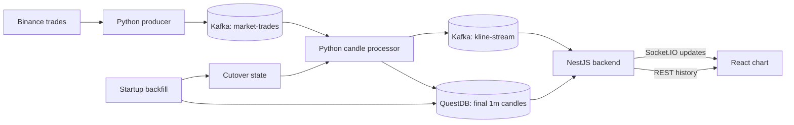

# NexTick

<p align="center">
  
</p>

NexTick is a realtime cryptocurrency market-data pipeline and charting system. It ingests Binance trades, builds OHLCV candles, persists canonical one-minute history, and delivers historical and live data to a browser chart.

NexTick is not a trading bot: it does not place orders, manage portfolios, or provide financial advice.

## Preview

A current application screenshot is not committed to this repository. The UI is a dark, multi-pane candlestick chart with volume, configurable indicators, symbol and interval controls, OHLCV details, and visible-range high/low labels.

<!-- Add a screenshot captured from the current UI here when one is available. -->

## Key Features

- Binance combined `@trade` stream ingestion for configured symbols.
- OHLCV aggregation for 15 configured intervals, with open updates and final candles.
- Kafka boundaries between ingestion, candle processing, and browser delivery.
- Startup reconciliation from Binance REST data, with a deterministic backfill/realtime cutover.
- Final `1m` candle persistence in a QuestDB WAL/dedup table.
- Historical aggregation through `GET /candles` and live delivery through Socket.IO rooms.
- A bounded backend cache that bridges recent Kafka updates into REST responses and new Socket.IO subscriptions.
- Client-side EMA, MA, volume MA, RSI, and MACD indicators with session-scoped preferences.
- Persisted processor state and retry queues for restart recovery.

## Architecture



Docker Compose runs Kafka, Kafka UI, QuestDB, and the Python services. The NestJS backend and React frontend run as separate local processes. See [System Architecture](docs/architecture.md) for contracts, guarantees, failure behavior, and design trade-offs.

## Tech Stack

| Layer | Primary technologies |
| --- | --- |
| Frontend | React 19, TypeScript 6, Vite 8, Tailwind CSS 4 |
| Charting | Lightweight Charts 5, client-side indicator calculations |
| Backend | NestJS 11, KafkaJS 2, `pg` 8, Swagger, Socket.IO |
| Data pipeline | Python 3.10, `kafka-python` 2.0, `psycopg2` 2.9, `websocket-client` 1.6 |
| Event streaming | Confluent Kafka 7.4 image, two three-partition topics |
| Database | QuestDB through its PostgreSQL wire protocol |
| Infrastructure | Docker Compose and named volumes |
| Testing/tooling | Python `unittest`, Jest 30, ESLint 10, TypeScript build checks |

Dependency ranges are declared in the component package files; lockfiles contain the resolved Node dependency versions. The QuestDB and Kafka UI images currently use the unpinned `latest` tag.

## Engineering Highlights

**Deterministic startup handoff.** The producer can buffer trades while the one-shot backfill reconciles closed Binance `1m` candles. Backfill records an exclusive cutover; the processor rejects trades, recovered candles, and retry entries before that boundary.

**Explicit ordering boundaries.** Raw trades use `symbol` as their Kafka key, and candle updates use `symbol_interval`. This preserves Kafka partition order for a symbol or series without claiming global ordering across symbols.

**Replay-tolerant processing.** Processor state is written before consumer offsets are committed. Replayed trade IDs are filtered, failed Kafka and QuestDB side effects enter persisted retry maps, and QuestDB upserts repeated candle keys. These mechanisms reduce replay effects, but they are not an exactly-once transaction.

**One historical source of truth.** Only final `1m` candles are durable. The backend derives larger historical intervals with QuestDB time-bucket queries while the processor emits configured higher-interval updates for the live chart.

**History/live convergence.** The backend merges its recent in-memory Kafka tail into REST history. The frontend merges candles by timestamp, performs a full series resync for out-of-order inserts, and makes bounded history refetches when it detects a recent gap.

## Quick Start

Prerequisites and complete environment values are in [Local Setup and Operations](docs/setup.md).

```powershell
Copy-Item data_pipeline\.env.example data_pipeline\.env
Copy-Item backend\.env.example backend\.env
Copy-Item frontend\.env.example frontend\.env
```

Fill the blank backend and frontend files as documented, then start the pipeline and infrastructure:

```bash
docker compose up -d kafka kafka-ui kafka-setup questdb data-producer data-backfill data-processor
```

Run the application processes in two terminals:

```bash
cd backend
npm ci
npm run start:dev
```

```bash
cd frontend
npm ci
npm run dev
```

Open `http://localhost:5173`. Startup backfill intentionally waits for the Binance minute that was open at startup to close, so first-run data is not immediate.

## Documentation

| Document | Scope |
| --- | --- |
| [Architecture](docs/architecture.md) | Authoritative system design, contracts, reliability semantics, decisions, and limitations |
| [Setup and operations](docs/setup.md) | Environment configuration, startup, verification, repair, migration, troubleshooting, and reset procedures |
| [Backend](backend/README.md) | NestJS modules, REST, Kafka consumer, cache, Socket.IO, and tests |
| [Frontend](frontend/README.md) | React chart architecture, data synchronization, indicators, preferences, and build status |
| [Data pipeline](data_pipeline/README.md) | Producer, aggregation, persistence, recovery, reconciliation, and tests |

## Verification

```bash
cd backend && npm test && npm run build
cd ../frontend && npm run lint && npm run build
cd .. && python -m unittest data_pipeline.tests.test_startup_backfill
```

The backend lint script runs ESLint with `--fix`; use it deliberately because it can modify TypeScript files. The full command matrix and runtime checks are in the [setup guide](docs/setup.md#verification).

## Current Limitations

- The Compose topology is local and single-node: Kafka uses plaintext listeners and replication factor `1`; QuestDB is one instance.
- Binance WebSocket ingestion and Socket.IO delivery are best-effort. There is no end-to-end exactly-once guarantee or replayable browser session.
- Startup reconciliation is capped at eight hours per symbol and starts after the newest valid watermark; it does not scan older history for gaps.
- The backend cache and Socket.IO rooms are process-local. Multiple backend replicas would need a shared fan-out/cache strategy and Socket.IO scaling configuration.
- The processor's local aggregation state is not designed for consumer-group rebalances across multiple processor replicas.
- There is no authentication, authorization, rate limiting, TLS termination, metrics backend, alerting, or documented production deployment.
- Backend tests are mostly module-construction smoke tests plus health behavior; pipeline tests focus on startup cutover logic. The frontend has no automated test command.
- QuestDB and Kafka UI use `latest` image tags, which makes rebuilds less reproducible.
- The repository has no committed application screenshot, hosted demo, benchmark results, or project license.

## Future Work

The current boundaries support a focused next set of improvements: pin infrastructure images, add Kafka/QuestDB/Socket.IO integration tests, make room subscriptions reconnect-safe, add shared realtime fan-out for backend replicas, extend reconciliation beyond the trailing eight-hour window, and add production-oriented authentication, transport security, metrics, and deployment guidance.
