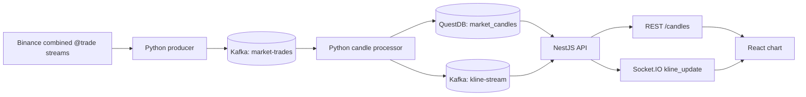

# NexTick

NexTick is a real-time cryptocurrency market-data collection, processing, and charting system. It receives raw Binance trades, creates OHLCV candles, stores closed `1m` candles in QuestDB, and serves historical and real-time data to a chart interface.

NexTick is for market data and charting only. It is not a trading bot and does not provide financial advice.

## Components and data flow



| Component | Responsibility |
| --- | --- |
| `data_pipeline/` | Reads Binance trades, publishes Kafka messages, creates candles, runs startup backfill, and writes QuestDB. |
| `backend/` | NestJS API that reads QuestDB history, consumes Kafka real-time updates, and exposes Socket.IO. |
| `frontend/` | React application that renders charts and communicates only with the backend. |
| Docker Compose | Runs Kafka, Kafka UI, QuestDB, and the three Python services. |

### Startup workflow

1. `kafka-setup` creates the `market-trades` and `kline-stream` topics.
2. `data-producer` connects to Binance and continuously writes raw trades to `market-trades`.
3. `data-backfill` runs once. It is enabled by default, chooses a UTC cutover from Binance time, fills missing `1m` candles up to that cutover, and saves shared state.
4. `data-processor` starts only after backfill completes. It consumes buffered Kafka trades, ignores candles before the backfill cutover, and creates real-time candles.
5. The processor publishes both open and final candles to `kline-stream`; only final `1m` candles are written to `market_candles`.
6. The backend keeps a recent real-time tail in memory, serves history over REST, and emits room-scoped Socket.IO messages in the form `SYMBOL_interval`.

This cutover ensures that each minute belongs to either backfill or the processor, never both.

## Requirements

- Docker Desktop or Docker Engine with Docker Compose
- Node.js and npm for the backend and frontend
- Python 3.10+ only when running the pipeline outside Docker
- Network access to Binance

## Run locally

The repository has no root `package.json`. Run npm commands from `backend/` or `frontend/`.

### 1. Create environment files

From the repository root in PowerShell:

```powershell
Copy-Item data_pipeline\.env.example data_pipeline\.env
Copy-Item backend\.env.example backend\.env
Copy-Item frontend\.env.example frontend\.env
```

Fill `backend/.env` and `frontend/.env` with local values; both example files are intentionally blank:

```env
# backend/.env
QUESTDB_HOST=localhost
QUESTDB_PORT=8812
QUESTDB_USER=admin
QUESTDB_PASSWORD=quest
QUESTDB_DB_NAME=qdb
QUESTDB_POOL_MAX=10
QUESTDB_POOL_TIMEOUT=5000
QUESTDB_POOL_IDLE_TIMEOUT=30000
KAFKA_BROKER=localhost:9092
KAFKA_TOPIC_KLINE_STREAM=kline-stream
KAFKA_CLIENT_ID=nextick-backend
KAFKA_GROUP_ID=nextick-backend-group
PORT=3000
FRONTEND_URL=http://localhost:5173
BACKEND_URL=http://localhost:3000
```

```env
# frontend/.env
VITE_API_URL=http://localhost:3000
VITE_API_HEALTH_URL=http://localhost:3000/health
VITE_SOCKET_URL=http://localhost:3000
VITE_TRADING_SYMBOLS=BTCUSDT,ETHUSDT
VITE_CANDLE_INTERVALS=1m,3m,5m,15m,30m,1h,2h,4h,6h,8h,12h,1d,3d,1w,1M
```

`data_pipeline/.env.example` already includes local defaults. Keep `TRADING_SYMBOLS`, `CANDLE_INTERVALS`, and Kafka topic names non-empty. Inside containers, Compose overrides `KAFKA_BROKER` to `kafka:29092` and `QUESTDB_HOST` to `questdb`.

### 2. Start infrastructure and the pipeline

```bash
docker compose up -d kafka kafka-ui kafka-setup questdb data-producer data-backfill data-processor
```

Compose builds the image automatically when no pipeline image exists. Add
`--build` only to force a rebuild after changing `Dockerfile`,
`requirements.txt`, or files under `data_pipeline/`:

```bash
docker compose up -d --build kafka kafka-ui kafka-setup questdb data-producer data-backfill data-processor
```

Monitor startup, especially backfill:

```bash
docker compose ps
docker compose logs -f kafka-setup data-producer data-backfill data-processor
```

Set `STARTUP_RECONCILE_ENABLED=false` in `data_pipeline/.env` only when intentionally skipping startup backfill. With the default `STARTUP_RECONCILE_REQUIRED=true`, the processor will not start if backfill exhausts its configured retries.

Startup backfill waits for the Binance minute that was open at startup to close, which can take up to one minute. `STARTUP_RECONCILE_CLOSE_GRACE_SECONDS=2` keeps only a short post-boundary safety delay; increase it if a Binance endpoint needs more time to expose closed candles.

### 3. Start the backend

```bash
cd backend
npm install
npm run start:dev
```

The backend starts even if QuestDB or Kafka is temporarily unavailable. It
retries both dependencies in the background every five seconds; `/health`
returns `503` until both are connected, while the Node.js process remains
running. Invalid backend environment values still need to be corrected before
the affected dependency can become available.

### 4. Start the frontend

In a separate terminal:

```bash
cd frontend
npm install
npm run dev
```

Open `http://localhost:5173`. On a first run, data may appear only after startup backfill and the processor have produced valid data.

## Local URLs

| Service | Address |
| --- | --- |
| Frontend | `http://localhost:5173` |
| Backend | `http://localhost:3000` |
| Health | `http://localhost:3000/health` |
| Swagger | `http://localhost:3000/api/docs` |
| Kafka UI | `http://localhost:8080` |
| QuestDB Console | `http://localhost:9000` |

## Primary data contracts

- Raw trade (`market-trades`): `symbol`, `trade_id`, `timestamp` (Unix milliseconds), `event_time`, `price`, `quantity`.
- Kline (`kline-stream`): UTC ISO 8601 `timestamp`, `symbol`, `interval`, `open`, `high`, `low`, `close`, `volume`, `is_final`.
- REST: `GET /candles?symbol=BTCUSDT&interval=1m&limit=100`; `limit` ranges from 1 to 2000.
- Socket.IO: clients send `join_kline_room`/`leave_kline_room` with `{ symbol, interval }`; the server emits `kline_update` to rooms such as `BTCUSDT_1m`.

Supported intervals throughout the system:

```text
1m, 3m, 5m, 15m, 30m, 1h, 2h, 4h, 6h, 8h, 12h, 1d, 3d, 1w, 1M
```

When adding a symbol, interval, topic, or changing a payload, update the pipeline, backend, frontend, and their corresponding `.env` files together.

## Verification and operation

```bash
# backend
cd backend
npm run build
npm run test
npm run test:e2e

# frontend
cd ../frontend
npm run build
npm run lint

# pipeline, from the repository root
python -m unittest data_pipeline.tests.test_startup_backfill
docker compose logs -f data-producer data-backfill data-processor
```

`backend/npm run lint` runs ESLint with `--fix`, so it may modify source files. Review its changes before committing.

To inspect stored candles, use QuestDB Console or run:

```sql
SELECT *
FROM market_candles
WHERE symbol = 'BTCUSDT'
ORDER BY timestamp DESC
LIMIT 20;
```

QuestDB uses the `questdb_data` named volume, Kafka uses `kafka_data`, and backfill/processor state uses `pipeline_state`. `docker compose down` preserves these volumes. Do not use a Windows bind mount for `/var/lib/questdb`.

## Repair stored candles

The command below uses Binance REST data to validate and replace a closed `1m` candle window. Stop the live writer first because repair can create and swap temporary tables:

```bash
docker compose stop data-processor
python -m data_pipeline.backfill.reconciler --dry-run
python -m data_pipeline.backfill.reconciler
docker compose start data-processor
```

See the [pipeline README](data_pipeline/README.md) for repair ranges, backups, and options.

## Module documentation

- [Python pipeline](data_pipeline/README.md)
- [NestJS backend](backend/README.md)
- [React frontend](frontend/README.md)
- [Detailed architecture](docs/architecture.md)
- [Extended setup guide](docs/setup.md)
