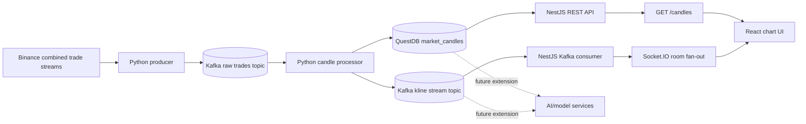

# NexTick

NexTick is a low-latency realtime cryptocurrency candle streaming system.

It ingests Binance trade ticks, moves them through Kafka, aggregates OHLCV candles in Python, stores historical candles in QuestDB, exposes validated REST and Socket.IO contracts through NestJS, and renders realtime chart updates in a React UI.

NexTick is a market data streaming and charting project. It is not a trading bot and does not provide financial advice.

## Project Overview

The repository is split into three application modules plus local infrastructure:

1. `data_pipeline/` owns ingestion, candle aggregation, QuestDB writes, and Kafka publishing.
2. `backend/` owns REST APIs, DTO validation, QuestDB reads, Kafka consumption, Swagger, and Socket.IO fan-out.
3. `frontend/` owns the browser charting UI.
4. Docker Compose runs Kafka, Kafka UI, QuestDB, `data-producer`, and `data-processor`.

Kafka is the service boundary between the Python pipeline and the backend. QuestDB is the time-series store for historical candles.

## Architecture



## Core Stack

| Area | Role | Main technologies |
| --- | --- | --- |
| `data_pipeline/` | Binance ingestion, raw trade publishing, O(1) OHLCV aggregation, QuestDB persistence, kline publishing | Python 3.10, `kafka-python`, `websocket-client`, `psycopg2`, `python-dotenv` |
| `backend/` | API gateway, validation, QuestDB queries, Kafka consumer, Socket.IO fan-out, Swagger | NestJS, TypeScript, KafkaJS, Socket.IO, `pg`, `class-validator`, Swagger |
| `frontend/` | Realtime charting UI, REST history loading, Socket.IO updates | React, Vite, TypeScript, Lightweight Charts, Axios, Socket.IO Client, Tailwind CSS |
| Infrastructure | Local streaming and storage runtime | Docker Compose, Kafka, Kafka UI, QuestDB |

## Runtime Flow

1. Binance emits trades through combined trade streams.
2. The Python producer normalizes each trade.
3. The producer publishes raw trades to `KAFKA_TOPIC_RAW_TRADES`.
4. The Python candle processor consumes raw trades and updates active OHLCV candle state.
5. Final `1m` candles are persisted to QuestDB table `market_candles`.
6. Final and non-final candles are published to `KAFKA_TOPIC_KLINE_STREAM`.
7. NestJS reads historical candles from QuestDB and consumes kline updates from Kafka.
8. React loads history through REST, joins a Socket.IO room, and updates Lightweight Charts.

## Local Quickstart

This repo does not have a root `package.json`. Run backend and frontend commands inside their own folders.

Create environment files from the examples:

```powershell
Copy-Item data_pipeline\.env.example data_pipeline\.env
Copy-Item backend\.env.example backend\.env
Copy-Item frontend\.env.example frontend\.env
```

For macOS/Linux or Git Bash:

```bash
cp data_pipeline/.env.example data_pipeline/.env
cp backend/.env.example backend/.env
cp frontend/.env.example frontend/.env
```

Use local values like these:

```env
# data_pipeline/.env
QUESTDB_HOST=localhost
QUESTDB_PORT=8812
QUESTDB_USER=admin
QUESTDB_PASSWORD=quest
QUESTDB_DB_NAME=qdb
KAFKA_BROKER=localhost:9092
KAFKA_TOPIC_RAW_TRADES=raw-trades
KAFKA_TOPIC_KLINE_STREAM=kline-stream
BINANCE_SOCKET_URL=wss://stream.binance.com:9443/stream
TRADING_SYMBOLS=BTCUSDT,ETHUSDT
CANDLE_INTERVALS=1m,3m,5m,15m,30m,1h,2h,4h,6h,8h,12h,1d,3d,1w,1M
CANDLE_UPDATE_INTERVAL_MS=500
```

```env
# backend/.env
QUESTDB_HOST=localhost
QUESTDB_PORT=8812
QUESTDB_USER=admin
QUESTDB_PASSWORD=quest
QUESTDB_DB_NAME=qdb
QUESTDB_POOL_MAX=10
QUESTDB_POOL_TIMEOUT=5000
QUESTDB_POOL_IDLE_TIMEOUT=30000
KAFKA_BROKER=localhost:9092
KAFKA_TOPIC_KLINE_STREAM=kline-stream
KAFKA_CLIENT_ID=nextick-backend
KAFKA_GROUP_ID=nextick-backend-group
PORT=3000
FRONTEND_URL=http://localhost:5173
BACKEND_URL=http://localhost:3000
```

```env
# frontend/.env
VITE_API_URL=http://localhost:3000
VITE_API_HEALTH_URL=http://localhost:3000/health
VITE_SOCKET_URL=http://localhost:3000
VITE_TRADING_SYMBOLS=BTCUSDT,ETHUSDT
VITE_CANDLE_INTERVALS=1m,3m,5m,15m,30m,1h,2h,4h,6h,8h,12h,1d,3d,1w,1M
```

Start Docker services first:

```bash
docker compose up -d --build kafka kafka-ui kafka-setup questdb data-processor data-producer
```

Start the backend:

```bash
cd backend
npm install
npm run start:dev
```

Start the frontend:

```bash
cd frontend
npm install
npm run dev
```

## Default Local URLs

| Service | URL |
| --- | --- |
| Frontend | `http://localhost:5173` |
| Backend API | `http://localhost:3000` |
| Backend health | `http://localhost:3000/health` |
| Swagger UI | `http://localhost:3000/api/docs` |
| Kafka UI | `http://localhost:8080` |
| QuestDB Console | `http://localhost:9000` |

## Project Structure

```text
NexTick/
|-- backend/
|   |-- src/
|   |   |-- common/
|   |   |-- modules/
|   |   |   |-- candles/
|   |   |   |-- database/
|   |   |   `-- kafka/
|   |   |-- app.module.ts
|   |   `-- main.ts
|   |-- package.json
|   `-- README.md
|-- data_pipeline/
|   |-- producer/
|   |   `-- binance_producer.py
|   |-- processor/
|   |   `-- candle_processor.py
|   |-- config.py
|   |-- logger_config.py
|   `-- README.md
|-- docs/
|   |-- architecture.md
|   |-- overview.md
|   `-- setup.md
|-- frontend/
|   |-- src/
|   |   |-- components/
|   |   |-- hooks/
|   |   |-- pages/
|   |   |-- services/
|   |   |-- types/
|   |   `-- utils/
|   |-- package.json
|   `-- README.md
|-- docker-compose.yml
|-- Dockerfile
|-- requirements.txt
`-- README.md
```

## Module Summary

| Module | Current features |
| --- | --- |
| `data_pipeline/` | Binance combined trade stream ingestion, raw trade Kafka publishing, multi-interval candle aggregation, final `1m` QuestDB writes, kline Kafka publishing. |
| `backend/` | `GET /`, `GET /health`, `GET /candles`, Swagger at `/api/docs`, Kafka kline consumer, Socket.IO `join_kline_room`, `leave_kline_room`, and `kline_update`. |
| `frontend/` | Realtime candlestick and volume chart, symbol/interval controls, EMA/MA overlays, OHLCV tooltip, `/terms` and `/privacy` static pages, footer API status using `VITE_API_HEALTH_URL`. |

## Documentation Index

| File | Scope |
| --- | --- |
| [`data_pipeline/README.md`](data_pipeline/README.md) | Python producer, processor, Kafka topics, QuestDB schema, timestamp rules |
| [`backend/README.md`](backend/README.md) | NestJS modules, REST endpoints, DTO validation, QuestDB queries, Socket.IO events |
| [`frontend/README.md`](frontend/README.md) | React chart UI, env config, REST and Socket.IO flow, chart update strategy |
| [`docs/overview.md`](docs/overview.md) | High-level project explanation for new readers |
| [`docs/architecture.md`](docs/architecture.md) | Detailed architecture, contracts, scaling, and future boundaries |
| [`docs/setup.md`](docs/setup.md) | Step-by-step local setup and troubleshooting |

## Boundary Rules

| Rule | Current boundary |
| --- | --- |
| Frontend only talks to backend REST and Socket.IO. | It does not connect to Binance, Kafka, QuestDB, or model services. |
| Backend is not the ingestion engine. | It does not connect to Binance and does not aggregate raw trades. |
| Python pipeline owns the write path. | It ingests trades, aggregates candles, writes QuestDB, and publishes kline updates. |
| Kafka and QuestDB are integration contracts. | Backend consumes processed kline updates from Kafka and reads history from QuestDB. |
| AI/model services are future extensions. | Replay buffers, model training, online learning, and forecasting should consume Kafka or QuestDB outside the API request path. |
