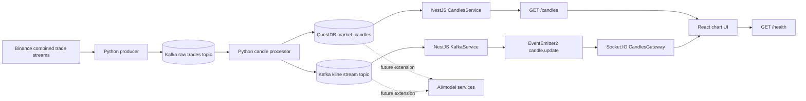

# NexTick

NexTick is a realtime cryptocurrency market-data streaming and charting system.

It ingests Binance trade ticks, publishes normalized trades through Kafka, aggregates OHLCV candles in Python, stores final `1m` candles in QuestDB, exposes validated REST and Socket.IO contracts through NestJS, and renders historical plus realtime candles in a React chart UI.

NexTick is not a trading bot and does not provide financial, investment, tax, or legal advice.

## Current Scope

| Area | Current implementation |
| --- | --- |
| Ingestion | Python producer connects to Binance combined trade streams and publishes normalized raw trades to Kafka. |
| Aggregation | Python processor keeps active OHLCV state per symbol and interval, then publishes final and non-final kline updates. |
| Storage | QuestDB stores final `1m` candles in `market_candles`; larger historical intervals are aggregated at read time. |
| Backend | NestJS validates REST and Socket.IO payloads, reads QuestDB, consumes Kafka kline updates, and fans out room updates. |
| Frontend | React + Lightweight Charts loads history, joins Socket.IO rooms, and renders candles, volume, tooltip data, and indicators. |
| Infrastructure | Docker Compose runs Kafka, Kafka UI, QuestDB, `data-producer`, and `data-processor`. |

Kafka is the service boundary between the Python pipeline and the backend. QuestDB is the time-series contract for historical candle reads.

## Architecture



## Tech Stack

| Module | Role | Main technologies |
| --- | --- | --- |
| `data_pipeline/` | Binance ingestion, raw trade publishing, O(1) candle aggregation, QuestDB writes, kline publishing | Python 3.10, `kafka-python`, `websocket-client`, `psycopg2`, `python-dotenv` |
| `backend/` | API gateway, DTO validation, QuestDB queries, Kafka consumer, Socket.IO fan-out, Swagger | NestJS 11, TypeScript 6, KafkaJS, Socket.IO, `pg`, `class-validator`, Swagger |
| `frontend/` | Realtime chart UI, REST history loading, Socket.IO updates, indicator controls | React 19, Vite 8, TypeScript 6, Lightweight Charts 5, Axios, Socket.IO Client, Tailwind CSS 4 |
| Infrastructure | Local streaming and storage runtime | Docker Compose, Kafka, Kafka UI, QuestDB |

## Runtime Flow

1. `data_pipeline.pipeline_runner` reconciles recent closed `1m` candles before the realtime processor starts.
2. Binance emits trade ticks through combined trade streams.
3. `BinanceCombinedProducer` normalizes each trade and publishes to `KAFKA_TOPIC_RAW_TRADES`.
4. `CandleProcessor` consumes raw trades and updates active candles for configured intervals.
5. Final `1m` candles are inserted into QuestDB table `market_candles`.
6. Final and non-final candles are published to `KAFKA_TOPIC_KLINE_STREAM`.
7. NestJS consumes kline updates from Kafka and emits internal `candle.update` events.
8. `CandlesGateway` broadcasts `kline_update` to rooms such as `BTCUSDT_1m`.
9. React loads history through `GET /candles`, joins the matching Socket.IO room, and updates Lightweight Charts.

## Local Quickstart

This repository has no root `package.json`. Run backend and frontend commands inside their own folders.

Copy env files from the repository root:

```powershell
Copy-Item data_pipeline\.env.example data_pipeline\.env
Copy-Item backend\.env.example backend\.env
Copy-Item frontend\.env.example frontend\.env
```

macOS/Linux or Git Bash:

```bash
cp data_pipeline/.env.example data_pipeline/.env
cp backend/.env.example backend/.env
cp frontend/.env.example frontend/.env
```

Fill the env files with local values:

```env
# data_pipeline/.env
QUESTDB_HOST=localhost
QUESTDB_PORT=8812
QUESTDB_USER=admin
QUESTDB_PASSWORD=quest
QUESTDB_DB_NAME=qdb
KAFKA_BROKER=localhost:9092
KAFKA_TOPIC_RAW_TRADES=raw-trades
KAFKA_TOPIC_KLINE_STREAM=kline-stream
BINANCE_SOCKET_URL=wss://stream.binance.com:9443/stream
TRADING_SYMBOLS=BTCUSDT,ETHUSDT
CANDLE_INTERVALS=1m,3m,5m,15m,30m,1h,2h,4h,6h,8h,12h,1d,3d,1w,1M
CANDLE_UPDATE_INTERVAL_MS=500
```

```env
# backend/.env
QUESTDB_HOST=localhost
QUESTDB_PORT=8812
QUESTDB_USER=admin
QUESTDB_PASSWORD=quest
QUESTDB_DB_NAME=qdb
QUESTDB_POOL_MAX=10
QUESTDB_POOL_TIMEOUT=5000
QUESTDB_POOL_IDLE_TIMEOUT=30000
KAFKA_BROKER=localhost:9092
KAFKA_TOPIC_KLINE_STREAM=kline-stream
KAFKA_CLIENT_ID=nextick-backend
KAFKA_GROUP_ID=nextick-backend-group
PORT=3000
FRONTEND_URL=http://localhost:5173
BACKEND_URL=http://localhost:3000
```

```env
# frontend/.env
VITE_API_URL=http://localhost:3000
VITE_API_HEALTH_URL=http://localhost:3000/health
VITE_SOCKET_URL=http://localhost:3000
VITE_TRADING_SYMBOLS=BTCUSDT,ETHUSDT
VITE_CANDLE_INTERVALS=1m,3m,5m,15m,30m,1h,2h,4h,6h,8h,12h,1d,3d,1w,1M
```

Start infrastructure and the Python pipeline:

```bash
docker compose up -d --build kafka kafka-ui kafka-setup questdb data-processor data-producer
```

Start the backend:

```bash
cd backend
npm install
npm run start:dev
```

Start the frontend:

```bash
cd frontend
npm install
npm run dev
```

## Default Local URLs

| Service | URL |
| --- | --- |
| Frontend | `http://localhost:5173` |
| Backend API | `http://localhost:3000` |
| Backend health | `http://localhost:3000/health` |
| Swagger UI | `http://localhost:3000/api/docs` |
| Kafka UI | `http://localhost:8080` |
| QuestDB Console | `http://localhost:9000` |
| Kafka broker for host apps | `localhost:9092` |
| QuestDB PostgreSQL wire for host apps | `localhost:8812` |

## Project Structure

```text
NexTick/
|-- backend/
|   |-- src/
|   |   |-- common/
|   |   |-- modules/
|   |   |   |-- candles/
|   |   |   |-- database/
|   |   |   `-- kafka/
|   |   |-- app.controller.ts
|   |   |-- app.module.ts
|   |   |-- app.service.ts
|   |   `-- main.ts
|   |-- test/
|   |-- package.json
|   `-- README.md
|-- data_pipeline/
|   |-- producer/
|   |   `-- binance_producer.py
|   |-- processor/
|   |   `-- candle_processor.py
|   |-- config.py
|   |-- logger_config.py
|   `-- README.md
|-- docs/
|   |-- architecture.md
|   |-- overview.md
|   `-- setup.md
|-- frontend/
|   |-- src/
|   |   |-- components/
|   |   |-- hooks/
|   |   |-- pages/
|   |   |-- services/
|   |   |-- types/
|   |   `-- utils/
|   |-- package.json
|   `-- README.md
|-- docker-compose.yml
|-- Dockerfile
|-- requirements.txt
`-- README.md
```

## Module Summary

| Module | Current features |
| --- | --- |
| `data_pipeline/` | Binance combined trade stream ingestion, raw trade Kafka publishing, multi-interval candle aggregation, final `1m` QuestDB writes, kline Kafka publishing, retry/backoff handling. |
| `backend/` | `GET /`, `GET /health`, `GET /candles`, Swagger at `/api/docs`, Kafka kline consumer, Socket.IO `join_kline_room`, `leave_kline_room`, and `kline_update`. |
| `frontend/` | Realtime candlestick and volume chart, symbol/interval controls, OHLCV tooltip, scroll-to-latest, EMA/MA/volume-MA/RSI/MACD indicators, `/terms`, `/privacy`, and footer API status. |

## Commands

Backend:

```bash
cd backend
npm run build
npm run lint
npm run test
npm run test:e2e
```

Frontend:

```bash
cd frontend
npm run build
npm run lint
```

Pipeline operational checks:

```bash
docker compose ps
docker compose logs -f data-producer data-processor
```

## Documentation Index

| File | Scope |
| --- | --- |
| [`docs/overview.md`](docs/overview.md) | Product scope, module map, current features, and out-of-scope items. |
| [`docs/architecture.md`](docs/architecture.md) | Runtime boundaries, data contracts, storage model, validation, and scaling notes. |
| [`docs/setup.md`](docs/setup.md) | Local setup, env values, verification commands, and troubleshooting. |
| [`data_pipeline/README.md`](data_pipeline/README.md) | Python producer, processor, Kafka topics, QuestDB schema, timestamp rules. |
| [`backend/README.md`](backend/README.md) | NestJS modules, REST endpoints, DTO validation, QuestDB queries, Socket.IO events. |
| [`frontend/README.md`](frontend/README.md) | React chart UI, env config, REST and Socket.IO flow, chart and indicator behavior. |

## Boundary Rules

| Rule | Current boundary |
| --- | --- |
| Frontend only talks to backend REST and Socket.IO. | It does not connect to Binance, Kafka, QuestDB, or model services. |
| Backend is not the ingestion engine. | It does not connect to Binance and does not aggregate raw trades. |
| Python pipeline owns the write path. | It ingests trades, aggregates candles, writes QuestDB, and publishes kline updates. |
| Kafka and QuestDB are integration contracts. | Backend consumes processed kline updates from Kafka and reads history from QuestDB. |
| AI/model services are future extensions. | Replay buffers, model training, online learning, and forecasting should consume Kafka or QuestDB outside the API request path. |
