# NexTick: Real-Time Trading Data Platform

[]()
[](https://www.typescriptlang.org/)
[](https://www.python.org/)
[](https://nestjs.com/)
[](https://react.dev/)

A production-grade monorepo containing a real-time cryptocurrency trading data platform with multi-timeframe candlestick aggregation, powered by Kafka and backed by QuestDB for high-performance time-series storage.

## Table of Contents

- [Overview](#overview)
- [Architecture](#architecture)
- [Project Structure](#project-structure)
- [Prerequisites](#prerequisites)
- [Quick Start](#quick-start)
- [Service Startup Order](#service-startup-order)
- [Development Workflow](#development-workflow)
- [Inter-Service Communication](#inter-service-communication)
- [Database Setup](#database-setup)
- [Troubleshooting](#troubleshooting)
- [Contributing](#contributing)

## Overview

NexTick is a complete real-time trading data platform designed for cryptocurrency analysis and visualization. It:

- **Ingests** live trade data from Binance via WebSocket
- **Aggregates** raw trades into OHLCV candlesticks at multiple timeframes (1m, 5m, 15m, 30m, 1h, 4h, 1d, 3d, 1w, 1M)
- **Stores** market data in QuestDB for sub-millisecond query performance
- **Streams** real-time candle updates to frontend clients via WebSocket
- **Visualizes** candlestick charts with interactive UI built in React

The platform is containerized with Docker Compose for local development and production deployment.

## Architecture

### System Overview

```
┌─────────────────────────────────────────────────────────────────┐
│                      Data Flow Architecture                       │
└─────────────────────────────────────────────────────────────────┘

External Data Sources:
         Binance API
             │
             ▼
    ┌─────────────────┐
    │ Data Producer   │  (Python)
    │ (binance_       │  • Connects to Binance WebSocket
    │  producer.py)   │  • Streams live trades for multiple symbols
    └────────┬────────┘
             │ Raw trades (JSON)
             ▼
    ┌─────────────────────────────────────────┐
    │  Kafka (KRAFT Mode, Port 9092)          │
    │  Topics:                                │
    │  • kline_stream (candle updates)        │
    │  • raw_trades (incoming trades)         │
    └────────┬────────┬──────────────────────┘
             │        │
    ┌────────▼──┐  ┌──▼──────────────────┐
    │ Processor  │  │ NestJS Backend      │
    │ (candle_   │  │ (port 3000)         │
    │ processor  │  │                     │
    │  .py)      │  │ • REST API          │
    │            │  │ • WebSocket Gateway │
    │ • Aggregates    • Kafka Consumer    │
    │   trades   │  │ • DB Connection     │
    │ • Emits    │  │                     │
    │   multiple │  │ [Candles Module]    │
    │   intervals│  │  - Historical data  │
    └────────┬───┘  │  - Real-time events │
             │      └────────┬────────────┘
             │               │
             └─────────┬─────┘
                       │
                ┌──────▼──────────┐
                │ QuestDB         │
                │ (port 8812)     │
                │                 │
                │ Time-Series DB  │
                │ market_candles  │
                │ table           │
                └────────────────┘

Client Connection:
    ┌──────────────────┐
    │ Frontend (React) │  (Port 5173 dev, 80 prod)
    │                  │
    │ • Vite build tool │
    │ • Tailwind CSS    │
    │ • lightweight-    │
    │   charts          │
    │ • Socket.IO       │
    │ • Axios           │
    └────────┬─────────┘
             │ WebSocket + REST API
             ▼
    Backend (NestJS):3000
```

### Component Interaction

```mermaid
graph TB
    subgraph "Data Sources"
        Binance["🔗 Binance WebSocket"]
    end
    
    subgraph "Data Pipeline"
        Producer["Producer<br/>binance_producer.py<br/>Kafka Port: 9092"]
        Processor["Processor<br/>candle_processor.py<br/>Multi-interval Aggregation"]
    end
    
    subgraph "Message Broker"
        Kafka["Kafka Broker<br/>Port 9092"]
        KafkaUI["Kafka UI<br/>Port 8080"]
    end
    
    subgraph "Backend Service"
        Backend["NestJS Backend<br/>Port 3000"]
        KafkaConsumer["Kafka Consumer<br/>Receives Candles"]
        DBConnector["Database Service<br/>PostgreSQL/QuestDB"]
        WebSocketGateway["WebSocket Gateway<br/>Real-time Updates"]
        CandlesAPI["Candles API<br/>/candles Endpoint"]
    end
    
    subgraph "Storage"
        QuestDB["QuestDB<br/>Port 8812<br/>market_candles Table"]
    end
    
    subgraph "Frontend"
        React["React Application<br/>Port 5173 dev<br/>Port 80 prod"]
        Chart["Trading Chart<br/>lightweight-charts"]
        API["API Service<br/>REST Client"]
        Socket["Socket Client<br/>Real-time Updates"]
    end
    
    Binance -->|Trade Stream| Producer
    Producer -->|Raw Trades JSON| Kafka
    Processor -->|Consumes Trades| Kafka
    Processor -->|Aggregated Candles| Kafka
    
    KafkaConsumer -->|Consumes Candles| Kafka
    KafkaUI -.->|Monitor| Kafka
    
    KafkaConsumer -->|Events| WebSocketGateway
    CandlesAPI -->|Queries| DBConnector
    DBConnector -->|SQL Query| QuestDB
    Processor -->|Stores Candles| QuestDB
    
    React -->|WebSocket Connection| WebSocketGateway
    React -->|REST GET| CandlesAPI
    WebSocketGateway -->|kline_update Event| React
    
    style Binance fill:#f9a825
    style Kafka fill:#231f20
    style QuestDB fill:#3dd8ff
    style React fill:#61dafb
    style Backend fill:#ea2845
```



## Project Structure

```
NexTick/
├── backend/                      # NestJS REST API & WebSocket Server
│   ├── src/
│   │   ├── main.ts              # Application entry point
│   │   ├── app.module.ts        # Root module with imports
│   │   ├── app.controller.ts    # Health check endpoint
│   │   └── modules/
│   │       ├── candles/         # Candlestick data API
│   │       │   ├── candles.controller.ts    # GET /candles
│   │       │   ├── candles.service.ts       # Business logic
│   │       │   ├── candles.gateway.ts       # WebSocket handler
│   │       │   └── candles.module.ts
│   │       ├── kafka/           # Message broker integration
│   │       │   ├── kafka.service.ts         # Consumer/Producer
│   │       │   └── kafka.module.ts
│   │       └── database/        # QuestDB connection
│   │           ├── database.service.ts      # Query execution
│   │           └── database.module.ts
│   ├── test/                    # E2E tests
│   ├── package.json
│   ├── tsconfig.json
│   ├── nest-cli.json
│   └── README.md               # Backend-specific documentation
│
├── frontend/                     # React Vite Application
│   ├── src/
│   │   ├── main.tsx            # React entry point
│   │   ├── App.tsx             # Root component
│   │   ├── index.css           # Global styles (Tailwind)
│   │   ├── components/
│   │   │   ├── chart/          # Trading chart components
│   │   │   │   └── TradingChart.tsx
│   │   │   └── layout/         # Page layout components
│   │   │       ├── MainLayout.tsx
│   │   │       ├── Header.tsx
│   │   │       └── Footer.tsx
│   │   ├── hooks/              # React hooks
│   │   │   └── useMarketData.ts
│   │   ├── services/           # API & WebSocket clients
│   │   │   ├── api.ts          # Axios HTTP client
│   │   │   └── socket.ts       # Socket.IO WebSocket
│   │   ├── types/              # TypeScript interfaces
│   │   ├── utils/              # Utilities & helpers
│   │   └── assets/             # Static assets
│   ├── index.html
│   ├── vite.config.ts
│   ├── tailwind.config.js
│   ├── package.json
│   ├── tsconfig.json
│   └── README.md               # Frontend-specific documentation
│
├── data_pipeline/              # Python data processing
│   ├── producer/               # Trade data ingestion
│   │   └── binance_producer.py # Binance WebSocket → Kafka
│   ├── processor/              # Trade aggregation
│   │   └── candle_processor.py # Multi-timeframe candlesticks
│   ├── config.py               # Configuration & env variables
│   ├── logger_config.py        # Structured logging
│   └── __init__.py
│
├── docker-compose.yml          # Local development orchestration
├── Dockerfile                  # Python data pipeline image
├── requirements.txt            # Python dependencies
├── .env                        # Environment variables (git-ignored)
└── data/                       # Persistent volumes
    ├── kafka/                  # Kafka data
    └── questdb/                # QuestDB data

```

## Prerequisites

### System Requirements

- **Docker & Docker Compose** (v20.10+)
- **Node.js** (v18+)
- **Python** (v3.10+)
- **Git**

### Ports Required

| Service | Port | Purpose |
|---------|------|---------|
| Kafka Broker | 9092 | Message streaming |
| Kafka UI | 8080 | Management interface |
| QuestDB API | 8812 | Database connection |
| QuestDB Web | 9000 | Admin console |
| QuestDB ILP | 9009 | Ingestion protocol |
| NestJS Backend | 3000 | REST API & WebSocket |
| React Frontend | 5173 | Development server |
| React Frontend | 80 | Production server |

## Quick Start

### 1. Environment Setup

```bash
# Clone repository
git clone <repository-url>
cd NexTick

# Create .env file in project root
cat > .env << EOF
# Kafka Configuration
KAFKA_BROKER=kafka:29092
KAFKA_SERVER=kafka:29092
KAFKA_CLIENT_ID=nextick-backend
KAFKA_GROUP_ID=nextick-candle-consumer
KAFKA_TOPIC_KLINE_STREAM=kline_stream

# QuestDB Configuration
QUESTDB_USER=admin
QUESTDB_PASSWORD=quest
QUESTDB_HOST=questdb
QUESTDB_DB_NAME=qdb
QUESTDB_PORT=8812
QUESTDB_POOL_MAX=10
QUESTDB_POOL_TIMEOUT=30000
QUESTDB_POOL_IDLE_TIMEOUT=60000

# Data Pipeline
DATA_PRODUCER_SYMBOLS=BTCUSDT,ETHUSDT,BNBUSDT,XRPUSDT
EOF
```

### 2. Start Infrastructure

```bash
# Start all services (Kafka, QuestDB, Producer, Processor)
docker-compose up -d

# Verify services are running
docker-compose ps

# View logs
docker-compose logs -f
```

### 3. Start Backend

```bash
cd backend

# Install dependencies
npm install

# Start development server
npm run start:dev

# The backend will connect to Kafka and QuestDB automatically
```

### 4. Start Frontend

```bash
cd frontend

# Install dependencies
npm install

# Start development server
npm run dev

# Open http://localhost:5173 in browser
```

### Verification Checklist

- [ ] Kafka broker is running: `docker-compose ps` shows healthy
- [ ] Producer is sending trades: Check logs `docker-compose logs data-producer`
- [ ] Processor is aggregating: Check logs `docker-compose logs data-processor`
- [ ] Backend is running: `http://localhost:3000` responds
- [ ] Frontend loads: `http://localhost:5173` shows trading chart
- [ ] WebSocket connected: Check browser console for connection
- [ ] Chart displays candles: Historical data loads from API

## Service Startup Order

**Critical**: Services must start in this order to avoid connection failures:

```
1. Kafka Broker                (5-10 seconds startup)
   └─ Wait for: Port 9092 responsive

2. QuestDB                    (10-15 seconds startup)
   └─ Wait for: Port 8812 responsive, database ready

3. Data Producer              (Depends on: Kafka ready)
   └─ Connects to Kafka, starts streaming trades

4. Data Processor             (Depends on: Kafka ready, QuestDB ready)
   └─ Waits for QuestDB to be ready (see docker-compose.yml)
   └─ Consumes trades, publishes aggregated candles

5. Backend (NestJS)           (Depends on: Kafka ready, QuestDB ready)
   └─ Connects to Kafka consumer and QuestDB
   └─ Opens WebSocket gateway at port 3000

6. Frontend (React)           (Depends on: Backend ready)
   └─ Connects to backend REST API and WebSocket
   └─ Displays real-time trading chart
```

**Docker Compose** handles startup dependencies automatically via `depends_on` and health checks.

### Manual Startup (Local Development)

```bash
# Terminal 1: Start Docker services
docker-compose up

# Terminal 2: Wait for Kafka + QuestDB, then start backend
cd backend && npm run start:dev

# Terminal 3: Start frontend
cd frontend && npm run dev
```

## Development Workflow

### Backend Development

See [backend/README.md](backend/README.md) for detailed documentation on:
- API endpoints and request/response formats
- WebSocket events and room patterns
- Database queries and schema
- Event emitter patterns
- Testing and debugging

**Common commands:**

```bash
cd backend

# Development with hot reload
npm run start:dev

# Debugging
npm run start:debug

# Testing
npm run test          # Unit tests
npm run test:watch    # Watch mode
npm run test:e2e      # End-to-end tests

# Linting & formatting
npm run lint          # Fix linting issues
npm run format        # Format code with Prettier
```

### Frontend Development

See [frontend/README.md](frontend/README.md) for detailed documentation on:
- Component structure and layouts
- State management and hooks
- API client integration
- WebSocket connection handling
- Build and deployment

**Common commands:**

```bash
cd frontend

# Development with hot reload
npm run dev

# Building for production
npm run build

# Preview production build
npm run preview

# Linting
npm run lint
```

### Data Pipeline Development

The Python data pipeline runs in Docker containers but can be modified locally:

```bash
# Install dependencies locally
pip install -r requirements.txt

# Test producer (requires Kafka running)
python -m data_pipeline.producer.binance_producer

# Test processor (requires Kafka + QuestDB running)
python -m data_pipeline.processor.candle_processor
```

**Key modules:**
- `data_pipeline/config.py` - Environment variable parsing
- `data_pipeline/logger_config.py` - Structured logging setup
- `data_pipeline/producer/binance_producer.py` - Binance WebSocket ingestion
- `data_pipeline/processor/candle_processor.py` - OHLCV aggregation

## Inter-Service Communication

### 1. Binance → Producer (WebSocket)

**Producer** connects to Binance WebSocket Stream:
- **Symbols**: Configurable via `DATA_PRODUCER_SYMBOLS` env variable
- **Data**: Real-time trade messages (price, volume, timestamp)
- **Frequency**: ~1 message per trade (varies by volume)

### 2. Producer → Kafka (JSON)

**Topic**: `raw_trades` (implicit, used for intermediate processing)

**Message format:**
```json
{
  "symbol": "BTCUSDT",
  "trade_id": 12345,
  "price": 45000.50,
  "qty": 0.5,
  "timestamp": 1634567890000,
  "buyer_maker": false
}
```

### 3. Processor → Kafka (JSON)

**Topic**: `kline_stream`

**Message format:**
```json
{
  "symbol": "BTCUSDT",
  "interval": "1m",
  "timestamp": "2024-01-15T10:30:00Z",
  "open": 45000.00,
  "high": 45500.00,
  "low": 44900.00,
  "close": 45200.00,
  "volume": 125.5,
  "is_final": true
}
```

**Multiple intervals**: Processor emits `is_final=true` for completed candles and `is_final=false` for updating candles.

### 4. Backend Kafka Consumer → Event Emitter

**Service**: `KafkaService` (modules/kafka/kafka.service.ts)

- Consumes from `kline_stream` topic
- Validates required fields (symbol, interval, OHLCV)
- Emits NestJS event: `candle.update`

### 5. Backend Event → WebSocket Gateway

**Service**: `CandlesGateway` (modules/candles/candles.gateway.ts)

- Listens to `candle.update` event
- Emits to Socket.IO room: `{SYMBOL}_{INTERVAL}`
- Example: Room `BTCUSDT_1m` receives only BTC 1-minute updates

### 6. Backend → Database

**Service**: `DatabaseService` (modules/database/database.service.ts)

- **Driver**: PostgreSQL (`pg` package)
- **Host**: QuestDB at port 8812
- **Query pattern**: Direct SQL with parameterized queries
- **Table**: `market_candles` (processed by candle processor)

### 7. Frontend API Requests

**Historical Candles**:
```
GET /candles?symbol=BTCUSDT&interval=1m&limit=100
Response: { success: true, symbol, interval, count, data: [...] }
```

**WebSocket Connection**:
```javascript
// Join room for real-time updates
socket.emit('join_kline_room', { symbol: 'BTCUSDT', interval: '1m' })

// Receive updates
socket.on('kline_update', (candle) => {
  // Update chart with new candle
})

// Leave room
socket.emit('leave_kline_room', { symbol: 'BTCUSDT', interval: '1m' })
```

## Database Setup

### QuestDB Overview

- **Purpose**: Time-series database for OHLCV market data
- **Advantages**: Sub-millisecond query performance, columnar storage, SQL compatibility
- **Port**: 8812 (PostgreSQL wire protocol)
- **Admin UI**: http://localhost:9000

### Table Schema

**Table**: `market_candles`

```sql
CREATE TABLE IF NOT EXISTS market_candles (
  timestamp TIMESTAMP,
  symbol SYMBOL,
  interval SYMBOL,
  open DOUBLE,
  high DOUBLE,
  low DOUBLE,
  close DOUBLE,
  volume DOUBLE,
  is_final BOOLEAN
) TIMESTAMP (timestamp) PARTITION BY DAY WAL;
```

### Processor Insert Pattern

The candle processor writes completed candles to QuestDB. Aggregation example:

```sql
SELECT 
  timestamp,
  symbol,
  interval,
  first(open) AS open,
  max(high) AS high,
  min(low) AS low,
  last(close) AS close,
  sum(volume) AS volume
FROM market_candles
WHERE symbol = 'BTCUSDT' AND interval = '1m'
SAMPLE BY 5m ALIGN TO CALENDAR
ORDER BY timestamp DESC
LIMIT 100;
```

### Querying from Backend

The `getHistoricalCandles` method aggregates 1-minute candles:

```typescript
// Input: symbol='BTCUSDT', interval='5m', limit=100
// Query: Sample 1m data by 5m intervals
// Output: Last 100 completed 5-minute candles in ascending order
```

## Troubleshooting

### Service Won't Start

**Kafka is not responding**
```bash
# Check Kafka container
docker-compose logs kafka

# Verify port 9092 is accessible
netstat -an | grep 9092

# Restart Kafka
docker-compose restart kafka
```

**QuestDB is not responding**
```bash
# Check QuestDB logs
docker-compose logs questdb

# Wait longer for QuestDB to initialize (can take 30 seconds)
# Monitor progress at http://localhost:9000
```

### No Data in Charts

**Check Producer logs**
```bash
docker-compose logs data-producer

# Verify trading symbols are configured
# Check Kafka topic has messages
```

**Check Processor logs**
```bash
docker-compose logs data-processor

# Verify candles are being aggregated correctly
# Check QuestDB has data: http://localhost:9000
```

**Check Backend Kafka connection**
```bash
# Check backend logs
npm run start:dev

# Verify KAFKA_BROKER and KAFKA_GROUP_ID in .env
```

### WebSocket Connection Failures

**Browser console shows connection errors**
```javascript
// Check frontend socket configuration (frontend/src/services/socket.ts)
// Verify backend is running: curl http://localhost:3000
// Check CORS configuration in main.ts
```

**Candles not updating in real-time**
```bash
# Verify WebSocket room is joined
# Check backend gateway logs for room messages
# Verify Kafka messages are being emitted
```

### Database Connection Errors

**Backend logs show "Failed to establish database connection"**
```bash
# Test QuestDB connection
psql -h localhost -U admin -d qdb

# Verify QuestDB is running
curl http://localhost:9000

# Check QUESTDB_* env variables in .env
```

### Port Already in Use

```bash
# Find process using port 3000
lsof -i :3000

# Kill process or use different port
# Or stop other services: docker-compose down
```

## Contributing

### Code Standards

- **Backend**: NestJS conventions, TypeScript strict mode, ESLint
- **Frontend**: React hooks, functional components, TailwindCSS utilities
- **Data Pipeline**: Python type hints, docstrings, structured logging

### Commit Workflow

```bash
# 1. Create feature branch
git checkout -b feature/your-feature

# 2. Make changes, run tests
npm test          # backend
npm run lint      # frontend

# 3. Commit with clear messages
git commit -m "feat: add support for new trading pair"

# 4. Push and create pull request
git push origin feature/your-feature
```

### Testing

- **Backend**: Jest unit tests, E2E tests with supertest
- **Frontend**: Component testing with React Testing Library
- **Data Pipeline**: Unit tests for processor logic

Before submitting PRs, ensure:
```bash
# Backend
cd backend && npm test && npm run lint

# Frontend
cd frontend && npm run lint

# Python
python -m pytest data_pipeline/
```

---

For detailed documentation on specific services, see:
- [Backend README](backend/README.md) - REST API, WebSocket, NestJS architecture
- [Frontend README](frontend/README.md) - React components, state management, styling
