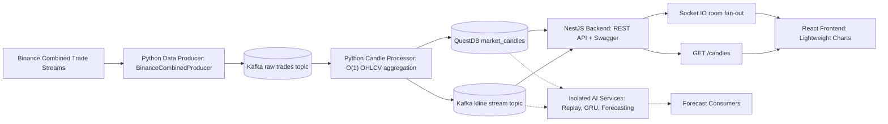

# NexTick

Low-latency cryptocurrency candle streaming with an isolated AI boundary.

NexTick ingests Binance trade ticks, transports them through Kafka, aggregates them into OHLCV candles in Python, persists authoritative historical candles in QuestDB, exposes validated REST and Socket.IO contracts through NestJS, and renders incremental updates in a React charting interface.

The project is deliberately split into operational boundaries. The API path is optimized for validation, historical reads, and realtime fan-out. AI, replay buffers, model training, online learning, and forecasting services are intentionally kept outside the NestJS request and Socket.IO flow.

## Architecture



## Core Stack

| Layer | Role | Main Technologies |
| --- | --- | --- |
| `data_pipeline/` | Binance ingestion, O(1) candle aggregation, QuestDB persistence, Kafka publishing | Python, `kafka-python`, `websocket-client`, `psycopg2`, QuestDB |
| `backend/` | API gateway, QuestDB querying, DTO validation, Swagger docs, Socket.IO fan-out | NestJS 11, TypeScript, KafkaJS, Socket.IO, `pg`, `class-validator` |
| `frontend/` | High-performance realtime charting UI | React 19, Vite, TypeScript, Lightweight Charts, Socket.IO Client, Axios |
| Infrastructure | Local streaming and storage runtime | Docker Compose, Kafka, Kafka UI, QuestDB |

## Runtime Flow

1. `BinanceCombinedProducer` connects to Binance combined trade streams for `TRADING_SYMBOLS`.
2. Raw trades are normalized and published to `KAFKA_TOPIC_RAW_TRADES`.
3. `CandleProcessor` consumes raw trades and updates in-memory candle state in O(1) time per symbol/timeframe.
4. Final `1m` candles are persisted to QuestDB table `market_candles`.
5. Final and non-final candle updates are published to `KAFKA_TOPIC_KLINE_STREAM`.
6. NestJS consumes kline updates, validates API/socket payloads, queries QuestDB for history, and fans out realtime updates by Socket.IO room.
7. React loads historical candles once, joins the matching Socket.IO room, and applies realtime updates with `series.update()`.

## Local Quickstart

Create environment files from the examples:

```bash
cp data_pipeline/.env.example data_pipeline/.env
cp backend/.env.example backend/.env
cp frontend/.env.example frontend/.env
```

Use local development values similar to:

```env
# data_pipeline/.env
QUESTDB_HOST=localhost
QUESTDB_PORT=8812
QUESTDB_USER=admin
QUESTDB_PASSWORD=quest
QUESTDB_DB_NAME=qdb
KAFKA_BROKER=localhost:9092
KAFKA_TOPIC_RAW_TRADES=raw-trades
KAFKA_TOPIC_KLINE_STREAM=kline-stream
BINANCE_SOCKET_URL=wss://stream.binance.com:9443/stream
TRADING_SYMBOLS=BTCUSDT,ETHUSDT
CANDLE_INTERVALS=1m,5m,15m,1h
CANDLE_UPDATE_INTERVAL_MS=500
```

```env
# backend/.env
QUESTDB_HOST=localhost
QUESTDB_PORT=8812
QUESTDB_USER=admin
QUESTDB_PASSWORD=quest
QUESTDB_DB_NAME=qdb
QUESTDB_POOL_MAX=10
QUESTDB_POOL_TIMEOUT=5000
QUESTDB_POOL_IDLE_TIMEOUT=30000
KAFKA_BROKER=localhost:9092
KAFKA_TOPIC_KLINE_STREAM=kline-stream
KAFKA_CLIENT_ID=nextick-backend
KAFKA_GROUP_ID=nextick-backend-group
PORT=3000
FRONTEND_URL=http://localhost:5173
BACKEND_URL=http://localhost:3000
```

```env
# frontend/.env
VITE_API_URL=http://localhost:3000
VITE_SOCKET_URL=http://localhost:3000
VITE_TRADING_SYMBOLS=BTCUSDT,ETHUSDT
VITE_CANDLE_INTERVALS=1m,5m,15m,1h
```

Start Docker services first. This project currently has no root `package.json`, so run the backend and frontend from their own directories after Kafka, QuestDB, and the Python pipeline are up.

```bash
docker compose up -d --build kafka kafka-ui kafka-setup questdb data-processor data-producer
```

Then start the backend. Do not start it before Docker infrastructure: the NestJS app opens QuestDB and Kafka connections during startup and exits if they are unavailable.

```bash
cd backend
npm install
npm run start:dev
```

Finally start the frontend:

```bash
cd frontend
npm install
npm run dev
```

Default local URLs:

| Service | URL |
| --- | --- |
| Frontend | `http://localhost:5173` |
| Backend API | `http://localhost:3000` |
| Swagger UI | `http://localhost:3000/api/docs` |
| QuestDB Console | `http://localhost:9000` |
| Kafka UI | `http://localhost:8080` |

## Project Structure

```text
NexTick/
|-- data_pipeline/
|   |-- producer/
|   |   `-- binance_producer.py
|   |-- processor/
|   |   `-- candle_processor.py
|   |-- config.py
|   `-- README.md
|-- backend/
|   |-- src/
|   |   `-- modules/
|   |       |-- candles/
|   |       |-- database/
|   |       `-- kafka/
|   `-- README.md
|-- frontend/
|   |-- src/
|   |   |-- components/
|   |   |-- hooks/
|   |   |-- services/
|   |   `-- utils/
|   `-- README.md
|-- docker-compose.yml
|-- requirements.txt
`-- README.md
```

## Boundary Rules

| Rule | Reason |
| --- | --- |
| The frontend talks only to NestJS REST and Socket.IO. | Prevents browser coupling to Kafka, QuestDB, Binance, or model internals. |
| NestJS does not ingest Binance streams or aggregate candles. | Keeps the gateway responsive and horizontally scalable. |
| The Python pipeline owns ingestion, aggregation, persistence, and kline publishing. | Keeps streaming state and storage writes close to the data path. |
| AI services are isolated from the API request path. | Training and forecasting can evolve independently without blocking market-data delivery. |
| Kafka and QuestDB are the integration contracts. | Services communicate through explicit topics and persisted time-series data. |

## Documentation

| File | Scope |
| --- | --- |
| [`data_pipeline/README.md`](data_pipeline/README.md) | Python ingestion, aggregation, Kafka, QuestDB schema, timestamp rules |
| [`backend/README.md`](backend/README.md) | NestJS API, validation, QuestDB queries, Socket.IO events |
| [`frontend/README.md`](frontend/README.md) | React charting, env config, realtime update strategy |
