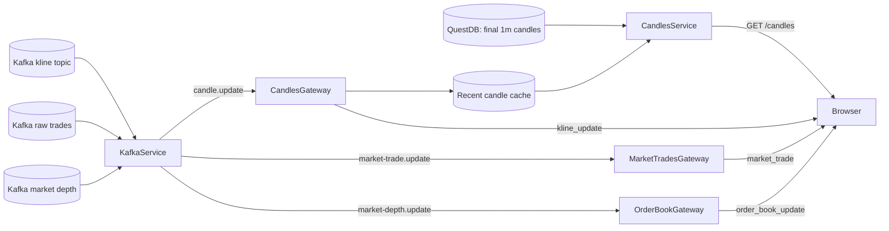

# NexTick Backend

The backend is NexTick's browser-facing boundary. It reads canonical candle history from QuestDB, consumes realtime kline, raw-trade, and market-depth updates from Kafka, maintains bounded recent caches, and exposes validated REST and Socket.IO contracts.

It does not connect to Binance, aggregate raw trades, or write canonical candles. Those responsibilities belong to the [data pipeline](../data_pipeline/README.md). System-level rationale and reliability semantics are in [System Architecture](../docs/architecture.md).

## Technology Stack

| Area | Technology |
| --- | --- |
| Application framework | NestJS 11, TypeScript 6 |
| REST validation/docs | `class-validator`, `class-transformer`, Swagger |
| Realtime transport | NestJS WebSockets and Socket.IO |
| Event consumption | KafkaJS 2 |
| Database access | `pg` 8 through QuestDB's PostgreSQL wire protocol |
| Internal dispatch | NestJS EventEmitter2 |
| Test tooling | Jest 30, `ts-jest`, Supertest; no committed TypeScript spec files |

## Responsibilities and Boundaries



- `CandlesService` owns historical query construction and cache/history merging.
- `KafkaService` owns the market-data consumer and converts kline, raw-trade, and market-depth Kafka JSON into normalized internal updates.
- `CandlesGateway` owns Socket.IO rooms and live emission.
- `RecentCandlesCacheService` owns the process-local recent tail shared by REST and Socket.IO.
- `MarketTradesGateway` and `OrderBookGateway` own their symbol-scoped Socket.IO rooms and snapshot/live delivery.
- `RecentMarketTradesCacheService` and `RecentOrderBookCacheService` own the corresponding process-local snapshots.
- `DatabaseService` owns the QuestDB connection pool and availability state.
- `AppService` combines Kafka and QuestDB availability for `/health`.

## Module Structure

| Path | Role |
| --- | --- |
| `src/main.ts` | Global validation, CORS, Swagger, shutdown hooks, and HTTP listener |
| `src/app.controller.ts` | Root and health endpoints |
| `src/modules/database/` | QuestDB pool and reconnect loop |
| `src/modules/kafka/` | KafkaJS kline/raw-trade/market-depth consumer and internal event emission |
| `src/modules/market-trades/` | Raw-trade normalization, recent cache, Socket.IO rooms, and browser fan-out |
| `src/modules/order-book/` | Market-depth normalization, latest-snapshot cache, Socket.IO rooms, and browser fan-out |
| `src/modules/candles/candles.controller.ts` | Historical candle REST endpoint |
| `src/modules/candles/candles.service.ts` | QuestDB aggregation, row validation, cache merge, and gap logging |
| `src/modules/candles/candles.gateway.ts` | Socket.IO room join/leave and kline fan-out |
| `src/modules/candles/recent-candles-cache.service.ts` | Bounded, final-aware recent cache |
| `src/modules/candles/dto/` | REST and Socket.IO DTOs |
| `src/modules/candles/candle-validation.ts` | Finite and internally consistent OHLCV checks |
| `src/modules/candles/candle-normalization.ts` | Symbol, timestamp, numeric, room-key, and update normalization |

Path aliases such as `@modules/*` are configured in `tsconfig.json`.

## REST API

| Method | Path | Response |
| --- | --- | --- |
| `GET` | `/` | Plain text `Hello World!` |
| `GET` | `/health` | `200` with dependency state when Kafka and QuestDB are available; `503` otherwise |
| `GET` | `/candles` | Historical candles merged with the recent realtime tail |
| `GET` | `/api/docs` | Swagger UI |

Example request:

```http
GET /candles?symbol=BTCUSDT&interval=5m&limit=100
```

| Query | Required | Validation |
| --- | --- | --- |
| `symbol` | Yes | Non-empty string, normalized to uppercase; non-alphanumeric characters are removed before the database query |
| `interval` | No | Defaults to `1m`; must be in the backend interval allowlist |
| `limit` | No | Defaults to `100`; integer from `1` through `2000` |

The response envelope contains `success`, the requested `symbol` and `interval`, `count`, and an oldest-to-newest `data` array. The complete payload contract is documented once in [System Architecture](../docs/architecture.md#rest-and-realtime-architecture) and generated in Swagger from the DTOs.

### Validation behavior

The global `ValidationPipe` enables transformation and strips properties not present in DTOs. REST and room intervals use the same allowlist; the exact identifiers are maintained with environment guidance in the [setup guide](../docs/setup.md#data_pipelineenv).

Kafka updates do not pass through controller DTO decorators. `KafkaService` explicitly normalizes kline, raw-trade, and market-depth payloads before emitting internal events. It rejects missing identities, unsafe IDs/timestamps, invalid sides, non-positive levels, and non-finite or internally inconsistent OHLCV. `CandlesService` applies the candle OHLCV rules to database rows before returning them.

## Historical Candle Aggregation

QuestDB stores final `1m` candles only. `CandlesService` derives every requested historical interval from that canonical table.

The query path:

1. Builds a time window equal to the larger of 24 hours or twice `interval * limit`.
2. Selects valid rows for the sanitized symbol and `interval='1m'`.
3. Uses a one-minute `SAMPLE BY` stage and retains a minute only when one physical version is visible. This avoids combining fields from multiple visible versions while QuestDB dedup catches up.
4. Uses `first(open)`, `max(high)`, `min(low)`, `last(close)`, and `sum(volume)` with calendar alignment for the requested interval.
5. For fixed-size intervals, returns only buckets containing the expected number of one-minute rows. `1M` omits that count filter because calendar months have different lengths.
6. Reads newest first for the SQL `LIMIT`, reverses to oldest first, filters invalid mapped rows, and merges cache entries by timestamp.
7. Logs duplicate timestamps and interval gaps found in the merged response; logging does not synthesize missing candles.

The bounded query window means a sparse result can contain fewer than `limit` rows even when older rows exist outside the window.

## Kafka Consumer

`KafkaService` creates one KafkaJS consumer using `KAFKA_GROUP_ID`, subscribes to `KAFKA_TOPIC_KLINE_STREAM`, `KAFKA_TOPIC_MARKET_TRADES`, and `KAFKA_TOPIC_MARKET_DEPTH` with `fromBeginning: false`, and processes messages through `eachMessage`.

For every valid kline it emits `candle.update`; for every valid raw trade it emits `market-trade.update`; for every valid partial-depth message it emits `market-depth.update`. Raw trades are normalized into browser-facing IDs, numeric values, quote quantity, and taker side. Depth levels are normalized into numeric price/quantity objects. Invalid JSON or market data is logged and skipped. KafkaJS's normal `eachMessage` auto-commit behavior applies; the backend does not maintain a dead-letter topic or application retry queue for invalid messages.

Klines use `symbol_interval` as their key, while raw trades and depth use `symbol`. Each series is ordered within its Kafka partition, but there is no global ordering across symbols or topics.

### Failure and reconnect behavior

- Initial connection failures retry in a backend loop every five seconds.
- KafkaJS also uses bounded client retries and `restartOnFailure` for consumer crashes.
- Group join marks Kafka available; crash and initialization failure mark it unavailable.
- A non-restartable crash triggers the outer reconnect loop.
- `/health` returns `503` while Kafka is unavailable, but the HTTP process stays up.
- On module shutdown, the consumer disconnects cleanly.

The broker-to-backend path can redeliver around failures. The cache upserts by candle timestamp, but Socket.IO clients can still observe repeated events.

## Socket.IO Contract

The gateway supports WebSocket and polling transports.

| Event | Direction | Payload |
| --- | --- | --- |
| `join_kline_room` | Client to server | `{ "symbol": "BTCUSDT", "interval": "1m" }` |
| `leave_kline_room` | Client to server | Same payload |
| `kline_update` | Server to client | Kline payload with OHLCV, UTC timestamp, symbol, interval, and `is_final` |
| `join_market_trades_room` | Client to server | `{ "symbol": "BTCUSDT" }` |
| `leave_market_trades_room` | Client to server | Same payload |
| `market_trades_snapshot` | Server to client | Up to 160 cached raw trades for the requested symbol |
| `market_trade` | Server to client | One normalized raw trade with ID, price, quantity, quote quantity, timestamp, symbol, and side |
| `join_order_book_room` | Client to server | `{ "symbol": "BTCUSDT" }` |
| `leave_order_book_room` | Client to server | Same payload |
| `order_book_snapshot` | Server to client | Latest cached 20-level bid/ask snapshot for the requested symbol |
| `order_book_update` | Server to client | Latest normalized 20-level bid/ask snapshot for the requested symbol |

Kline rooms use `UPPERCASE_SYMBOL_interval`, for example `BTCUSDT_1m`; Market Trades rooms use `market-trades:UPPERCASE_SYMBOL`; Order Book rooms use `order-book:UPPERCASE_SYMBOL`. A kline join replays cached candles as individual `kline_update` events, a Market Trades join emits one `market_trades_snapshot` array, and an Order Book join emits the latest `order_book_snapshot` when available. Subsequent accepted updates are broadcast to the matching room.

REST CORS accepts the configured `FRONTEND_URL`. Socket.IO accepts `FRONTEND_URL`, `BACKEND_URL`, or requests without an `Origin` header. Credentials are allowed, but the backend currently has no authentication or authorization.

## Recent Realtime Cache

`RecentCandlesCacheService` stores at most 500 candle timestamps per room:

- updates are normalized and validated before insertion;
- the key within a room is ISO timestamp;
- entries are kept in ascending timestamp order;
- an existing final entry is not replaced in the cache by a later non-final entry;
- REST merge lets a cache entry replace the same historical timestamp; and
- the final REST result is sorted and trimmed to `limit`.

The cache closes the normal interval between Kafka publication and QuestDB WAL visibility and gives new room members a recent tail. It is memory-only, process-local, and empty after a backend restart. The gateway broadcasts the incoming event even if cache finality rules reject that event as an overwrite.

`RecentMarketTradesCacheService` separately retains up to 160 raw trades per symbol, deduplicated by Binance trade ID and ordered newest first. A market-trades room join receives this snapshot before subsequent live events.

`RecentOrderBookCacheService` retains the newest depth snapshot per symbol and rejects an older `lastUpdateId`. An Order Book room join receives this snapshot before subsequent live updates.

## QuestDB Connection Behavior

`DatabaseService` creates a `pg.Pool` during module initialization and probes it in the background. Failed queries or pool errors mark QuestDB unavailable and start a five-second reconnect loop. Successful probes or queries mark it available again. Pool shutdown is tied to NestJS shutdown hooks.

Historical requests fail normally if QuestDB is unavailable; the cache is a merge source, not a standalone REST fallback.

## Backend Design Decisions

- **Separate read and write ownership.** The backend never writes `market_candles`; this prevents browser traffic from becoming part of canonical ingestion. The Python pipeline remains the single live writer.
- **Internal event boundary.** Kafka parsing emits `candle.update`, `market-trade.update`, or `market-depth.update` instead of calling gateways directly. This keeps transport consumption separate from Socket.IO delivery, at the cost of additional in-process contracts.
- **Recent cache at the API edge.** Merging the Kafka tail into REST avoids waiting for QuestDB WAL application. The trade-off is process-local state that does not scale across replicas.
- **Allowlisted SQL intervals.** QuestDB requires the interval in `SAMPLE BY`; validation occurs before interpolation. Symbols and timestamps remain query parameters.

Broader rationale and alternatives are in [Architecture Decisions and Trade-offs](../docs/architecture.md#architecture-decisions-and-trade-offs).

## Environment Variables

Create `.env` from `.env.example`. Exact local values are maintained in the [setup guide](../docs/setup.md#backendenv).

| Variable | Use |
| --- | --- |
| `QUESTDB_HOST`, `QUESTDB_PORT`, `QUESTDB_USER`, `QUESTDB_PASSWORD`, `QUESTDB_DB_NAME` | QuestDB PostgreSQL wire connection |
| `QUESTDB_POOL_MAX` | Maximum `pg.Pool` connections |
| `QUESTDB_POOL_TIMEOUT` | Connection timeout in milliseconds |
| `QUESTDB_POOL_IDLE_TIMEOUT` | Idle connection timeout in milliseconds |
| `KAFKA_BROKER` | Comma-separated Kafka brokers |
| `KAFKA_TOPIC_MARKET_TRADES` | Producer raw-trade topic |
| `KAFKA_TOPIC_MARKET_DEPTH` | Producer partial-depth topic |
| `KAFKA_TOPIC_KLINE_STREAM` | Processor kline topic |
| `KAFKA_CLIENT_ID` | KafkaJS client identifier |
| `KAFKA_GROUP_ID` | Backend consumer group |
| `PORT` | HTTP and Socket.IO listener port |
| `FRONTEND_URL` | Allowed browser origin |
| `BACKEND_URL` | Logged public backend URL and allowed Socket.IO origin |

The source does not define a configuration schema or startup validation for these variables. Empty or malformed values can leave a dependency retrying or prevent the listener from starting.

## Development Commands

```bash
npm ci
npm run start:dev
npm run build
```

Other scripts:

| Command | Purpose | Note |
| --- | --- | --- |
| `npm start` | Start NestJS once | Development TypeScript entrypoint |
| `npm run start:debug` | Watch with Node inspector | Local debugging |
| `npm run start:prod` | Run `dist/main` | Requires `npm run build` first |
| `npm test`, `npm run test:watch`, `npm run test:cov` | Jest unit-test commands | No committed `*.spec.ts` files currently exist |
| `npm run test:e2e` | Jest e2e command | Configuration remains, but no committed `*.e2e-spec.ts` file exists |
| `npm run lint` | ESLint | Includes `--fix` and can modify source files |
| `npm run format` | Prettier | Writes matching source files and any future test files |

## Test Coverage Status

The backend currently has no committed `*.spec.ts` or `*.e2e-spec.ts` files. Jest, `ts-jest`, Supertest, the unit-test configuration in `package.json`, and `test/jest-e2e.json` remain available for future tests, but the corresponding npm test commands currently report that no tests were found.

`npm run build` remains the backend compile check. There is currently no automated backend coverage for health behavior, Kafka normalization, caches, gateways, historical SQL, Socket.IO delivery/reconnects, DTO edge cases, or the full pipeline-to-browser path.

## Current Backend Limitations

- No authentication, authorization, rate limiting, or transport-security configuration.
- Process-local cache and Socket.IO rooms prevent correct same-group horizontal scaling without a shared fan-out design.
- Invalid Kafka messages are logged and skipped; there is no dead-letter stream.
- The history query uses a bounded heuristic window and can return fewer rows than requested for sparse data.
- Cache contents are not persisted or restored after restart.
- No committed backend unit, e2e, or real-dependency integration tests.
