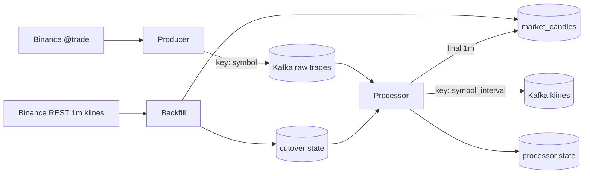

# NexTick Data Pipeline

`data_pipeline/` is NexTick's ingestion and canonical write path. It converts Binance trades into realtime OHLCV updates, persists final one-minute candles, reconciles a bounded closed-candle window at startup, and records enough local state to resume a single processor after restart.

It does not expose REST, Socket.IO, or browser UI. Those boundaries belong to the [backend](../backend/README.md) and [frontend](../frontend/README.md). System-wide contracts and trade-offs are authoritative in [System Architecture](../docs/architecture.md).

## Technology Stack

| Area | Technology |
| --- | --- |
| Runtime | Python 3.10 in the repository Docker image |
| Binance streaming | `websocket-client` 1.6 |
| Kafka | `kafka-python` 2.0 |
| QuestDB access | `psycopg2-binary` 2.9 over PostgreSQL wire protocol |
| Configuration | `python-dotenv` 1.2 |
| Tests | Standard-library `unittest` and mocks |

## Components

| Path | Responsibility |
| --- | --- |
| `producer/binance_producer.py` | Binance combined `@trade` connection, trade normalization, Kafka publication, reconnect loop |
| `processor/candle_aggregator.py` | Per-symbol/per-interval active candles, trade-ID filtering, bucket boundaries, finalization, snapshots |
| `processor/candle_processor.py` | Raw-trade consumption, kline publication, final `1m` writes, retries, offsets, recovery |
| `processor/state.py` | Atomic JSON processor-state reads/writes |
| `processor/runner.py` | Signals and the Compose ready marker |
| `backfill/reconciler.py` | Binance REST fetch/validation, watermark selection, table migration/replacement/verification |
| `backfill/runner.py` | Startup retry policy and cutover-state publication |
| `backfill/state.py` | Atomic shared backfill/cutover state |
| `common/config.py` | Required environment loading and supported interval mapping |
| `common/retry.py` | Bounded exponential infrastructure retries |

## Pipeline Flow



## Producer

`BinanceCombinedTradeProducer` lowercases configured symbols for Binance stream names and builds one combined URL, for example:

```text
wss://stream.binance.com:9443/stream?streams=btcusdt@trade/ethusdt@trade
```

It accepts only Binance events with `e == "trade"`, required identifiers/timestamps, a configured symbol, and positive price and quantity. Valid records contain:

| Field | Type | Source/use |
| --- | --- | --- |
| `symbol` | string | Uppercase Binance symbol; Kafka key |
| `trade_id` | integer | Binance trade ID; processor dedup/order marker |
| `timestamp` | integer | Binance trade time in Unix milliseconds; candle bucket input |
| `event_time` | integer | Binance event time; retained but not aggregated |
| `price` | number | OHLC input |
| `quantity` | number | Volume input |

The Kafka producer uses `acks=all`, five client retries, a short linger, and an outer retry around enqueue. Delivery remains best-effort: the application attaches an error logger to the asynchronous future but does not fetch a missed trade again from Binance.

When the WebSocket closes, the producer makes up to 10 reconnect attempts with exponential delay starting at five seconds and capped at 300 seconds. A successful `on_open` resets that counter. Compose also applies `restart: unless-stopped` to the container.

## Kafka Contracts

Topic values come from the environment and are created by `kafka-setup` with three partitions and replication factor `1`.

| Topic variable | Producer | Consumer | Key | Payload |
| --- | --- | --- | --- | --- |
| `KAFKA_TOPIC_MARKET_TRADES` | Binance producer | Candle processor | `symbol` | Normalized raw trade fields above |
| `KAFKA_TOPIC_KLINE_STREAM` | Candle processor | NestJS backend | `symbol_interval` | `symbol`, `interval`, ISO UTC `timestamp`, OHLCV, `is_final` |

Symbol keying keeps one symbol's accepted trades in one Kafka partition. Kline keying does the same for one symbol/interval series. There is no global ordering across partitions. Full JSON examples and consumer boundaries are in [Kafka Contracts](../docs/architecture.md#kafka-contracts).

Neither contract is versioned or schema-registry backed. Producer and consumer changes must be coordinated.

## Candle Aggregation

The processor validates the raw trade again, converts its timestamp to UTC, and passes it to one stateful `CandleAggregator`.

### Bucket rules

- Fixed intervals are aligned by Unix epoch duration.
- `1w` starts Monday at `00:00:00 UTC`.
- `1M` starts on the first day of the calendar month at `00:00:00 UTC`.
- Open is the first accepted trade price, high/low are extrema, close is the latest accepted price, and volume is summed trade quantity.
- No candle is synthesized for a bucket with no accepted trade.

The configured interval set is validated against the identifiers listed in the [setup guide](../docs/setup.md#data_pipelineenv); unknown values stop configuration rather than creating ad hoc buckets.

### Ordering, deduplication, and finalization

The aggregator stores the last accepted `trade_id` per symbol. A trade whose ID is less than or equal to that value is discarded for every interval. This handles common Kafka replay/duplicate cases but assumes trade IDs increase for a symbol; a late older ID is deliberately ignored.

A newer bucket finalizes the prior active candle before opening the next one. A periodic timer also finalizes a candle when its bucket end is at least two seconds behind current UTC time, so an interval can close without a later trade. Once a bucket is marked final, trades for that bucket or an earlier bucket are ignored.

Each accepted trade produces a mutable non-final snapshot for every configured interval. The processor coalesces those snapshots by symbol/interval/timestamp and normally publishes the latest value once per second. Final snapshots bypass coalescing and publish immediately.

## Startup Backfill and Reconciliation

`data-backfill` is a one-shot startup owner that runs before `data-processor` in Compose.

1. It removes stale startup state.
2. It reads Binance server time and chooses the next UTC minute boundary `C`.
3. By default it waits until `C` plus a two-second close grace.
4. It finds each symbol's newest valid final `1m` row before `C`.
5. A non-empty symbol fetches `[max(watermark + 1 minute, C - 480 minutes), C)`; an empty symbol fetches up to the configured bootstrap count, also capped at 480.
6. It validates Binance pagination, continuity, minute alignment, close times, uniqueness, and OHLCV before database writes.
7. For each selected symbol it stages data, builds a full replacement table, takes a full backup, recreates the live WAL/dedup table, and verifies exact keys and values within tolerance.
8. Only after every symbol succeeds does it atomically write cutover `C` and the per-symbol ranges.

The processor reads this cutover once during construction. It removes restored pre-cutover candle/finalization state and rejects every trade, broadcast, database write, and retry entry whose candle timestamp is before `C`. Timestamp `C` belongs to the processor.

With `STARTUP_RECONCILE_REQUIRED=true`, exhausted startup attempts return a failure exit code and Compose does not start the processor. If reconciliation is disabled, or allowed to fail with `STARTUP_RECONCILE_REQUIRED=false`, the processor can start without a fence.

Detailed handoff semantics are in [Startup backfill and cutover](../docs/architecture.md#startup-backfill-and-cutover).

### What reconciliation does not repair

- It does not inspect for gaps before the newest valid watermark.
- It cannot select an arbitrary historical start and end from the CLI.
- It does not compare valid existing older values against Binance.
- It never fetches more than the trailing eight hours in one run.
- It is not a continuous reconciliation daemon.

## QuestDB Persistence

Normal processing writes only final `1m` candles to `market_candles`:

```sql
CREATE TABLE IF NOT EXISTS market_candles (
  symbol SYMBOL,
  interval SYMBOL,
  timestamp TIMESTAMP,
  open DOUBLE,
  high DOUBLE,
  low DOUBLE,
  close DOUBLE,
  volume DOUBLE
) TIMESTAMP(timestamp)
PARTITION BY MONTH
DEDUP UPSERT KEYS(timestamp, symbol, interval);
```

The processor validates OHLCV before every write and retries the upsert three times. A repeated `(timestamp, symbol, interval)` key is resolved through QuestDB WAL dedup/upsert. This makes repeated writes converge but is not atomic with Kafka publication or consumer offsets.

The processor publishes a final kline before attempting its database write. This lets the backend cache expose the latest close while QuestDB WAL application catches up; a failed write enters the persisted database retry map.

## Recovery State and Offset Commits

Processor state version `1` contains:

- active aggregator candles;
- latest finalized bucket marker per symbol/interval;
- last trade ID per symbol;
- failed kline updates; and
- failed final `1m` database writes.

The JSON file is written to a sibling temporary file and atomically replaced. Approximately once per second, after processing polled records, the processor writes state and then manually commits the Kafka consumer position. Auto-commit is disabled.

This ordering favors replay safety: if the offset commit fails, restored `last_trade_ids` can reject replayed records. It is not one transaction across the file, Kafka, kline publication, and QuestDB. A crash can therefore repeat a kline or database attempt. The in-memory open-update coalescing map is not stored, although its underlying active candle is.

Under Compose, cutover and processor files share the `pipeline_state` named volume. Losing that volume removes active/retry recovery state.

## Retry Behavior

| Operation | Behavior |
| --- | --- |
| Kafka Python client creation | Up to 60 attempts with exponential delay capped at 10 seconds |
| Raw trade enqueue | Four outer attempts around `send`; Kafka client also has five retries; later asynchronous failure is logged |
| Kline publication | Waits up to 15 seconds for acknowledgement, makes four attempts, then stores a persisted retry entry |
| Final `1m` QuestDB upsert | Three attempts, then stores a persisted retry entry |
| Startup reconciliation | Configured attempt count and exponential delay capped at 60 seconds |
| Binance REST request | Five attempts for transient network/JSON, HTTP 418/429, and server errors, with delay capped at 30 seconds |
| Binance WebSocket reconnect | Ten connection attempts, delay capped at 300 seconds |

Retry maps are keyed by candle identity, so a newer non-final value replaces an older non-final retry and a final retry is not replaced by a later non-final retry. The separate in-memory live-coalescing map is flushed independently.

## Data Correctness Semantics

| Property | Current behavior |
| --- | --- |
| Per-symbol trade order | Preserved after Kafka admission through symbol keying and one partition; not global |
| Duplicate raw trades | IDs at or below the persisted per-symbol high-water mark are skipped |
| Final candle | Closed by a new bucket or the two-second expiry check; no later trade is applied to that bucket |
| Empty intervals | No synthetic candle |
| Startup ownership | Backfill owns timestamps before `C`; processor owns timestamps at/after `C` |
| Canonical history | Final `1m` only |
| Repeated database key | QuestDB WAL dedup/upsert convergence |
| Failed side effect | Bounded immediate retry, then persisted keyed retry |
| End-to-end delivery | Best-effort/replay-tolerant; not exactly once |

The producer cannot replay trades missed during a Binance WebSocket outage, and startup backfill has no producer-readiness handshake. For the complete guarantee matrix, see [Data and Reliability Guarantees](../docs/architecture.md#data-and-reliability-guarantees).

## Environment Configuration

Create `data_pipeline/.env` from `.env.example`. Exact local defaults and operational explanations are maintained in [Local Setup and Operations](../docs/setup.md#data_pipelineenv).

| Group | Variables |
| --- | --- |
| QuestDB | `QUESTDB_HOST`, `QUESTDB_PORT`, `QUESTDB_USER`, `QUESTDB_PASSWORD`, `QUESTDB_DB_NAME` |
| Kafka topics/broker | `KAFKA_BROKER`, `KAFKA_TOPIC_MARKET_TRADES`, `KAFKA_TOPIC_KLINE_STREAM` |
| Processor consumer | `KAFKA_CONSUMER_GROUP_ID`, `KAFKA_AUTO_OFFSET_RESET` |
| Binance and markets | `BINANCE_SOCKET_URL`, `TRADING_SYMBOLS`, `CANDLE_INTERVALS` |
| Startup policy | `STARTUP_RECONCILE_ENABLED`, `STARTUP_RECONCILE_REQUIRED`, `STARTUP_RECONCILE_MAX_ATTEMPTS`, `STARTUP_RECONCILE_RETRY_DELAY_SECONDS` |
| Startup range/validation | `STARTUP_RECONCILE_SYMBOLS`, `STARTUP_RECONCILE_DRY_RUN`, `STARTUP_RECONCILE_KEEP_TEMP`, `STARTUP_RECONCILE_BINANCE_REST_URL`, `STARTUP_RECONCILE_TOLERANCE`, `STARTUP_RECONCILE_BOOTSTRAP_CANDLES`, `STARTUP_RECONCILE_WAIT_FOR_OPEN_CANDLE_CLOSE`, `STARTUP_RECONCILE_CLOSE_GRACE_SECONDS` |
| State paths | `STARTUP_BACKFILL_STATE_FILE`, `CANDLE_PROCESSOR_STATE_FILE`, `PROCESSOR_READY_FILE` |

Because `common/config.py` validates Kafka, QuestDB, and Binance values during import, even a role that does not directly use every setting can fail when a required variable is blank.

## Local and Manual Execution

The full environment and startup sequence is in [Manual Pipeline Execution](../docs/setup.md#manual-pipeline-execution).

Compose entrypoints:

```bash
docker compose up -d kafka kafka-ui kafka-setup questdb data-producer data-backfill data-processor
docker compose logs -f data-producer data-backfill data-processor
```

Host entrypoints, after installing `requirements.txt`:

```bash
python -m data_pipeline.producer.binance_producer
python -m data_pipeline.backfill.runner
python -m data_pipeline.processor.runner
```

Start the producer first, run backfill to completion second, and start the processor last. Do not run host and Compose processors together.

## Repair Workflow

The supported operational workflow stops the processor, runs an isolated dry run, reruns `data-backfill` to both replace the eligible trailing range and write a new cutover, then restarts the processor. Follow [Trailing Reconciliation and Repair](../docs/setup.md#trailing-reconciliation-and-repair) exactly; the live table is copied/swapped and must have one writer.

Useful developer-only reconciler flags are:

```text
--symbols
--binance-rest-url
--dry-run
--keep-temp
--bootstrap-candles
--tolerance
```

`python -m data_pipeline.backfill.reconciler` performs the database operation but does not write shared processor cutover state. Do not use a direct non-dry run as a substitute for the backfill runner in an active pipeline.

## Tests

From the repository root:

```bash
python -m unittest data_pipeline.tests.test_startup_backfill
python -m compileall data_pipeline
```

The committed regression suite covers:

- Binance-time cutover and configurable close grace;
- independent symbol watermarks and the eight-hour cap;
- Binance pagination and continuous response validation;
- dry-run and required-failure state behavior;
- cutover state serialization;
- processor filtering at the cutover, including restored state and retry queues; and
- prevention of a partial startup-minute realtime candle.

Tests use mocks/fakes and do not connect to Binance, Kafka, or QuestDB. Producer reconnection, general aggregation across all intervals, offset/state crash windows, retry draining, database table swaps, and real broker/database integration are not covered.

## Pipeline Design Decisions

- **Raw trades cross Kafka before aggregation.** This allows producer buffering during backfill and replay after processor restart. It adds broker operation and retains only two hours in the local topology.
- **One aggregator builds all configured realtime intervals.** One accepted trade updates every interval consistently in one process. Cost grows with the number of symbols and intervals, and state is not portable across processor replicas.
- **Final `1m` is the only durable interval.** One canonical granularity simplifies correction and historical rollup. Larger historical queries spend database compute, and raw trade replay is unavailable.
- **State checkpoint precedes offset commit.** Replayed records can be rejected using persisted trade IDs. The file and Kafka offset still lack a transaction boundary.
- **Backfill uses validated replacement rather than blind inserts.** Staging, backup, and post-write comparison protect the selected range. Full-table copying is expensive and requires a maintenance window.

See [Architecture Decisions and Trade-offs](../docs/architecture.md#architecture-decisions-and-trade-offs) for alternatives and revisit conditions.

## Current Pipeline Limitations

- Single processor and local JSON state; not safe for stateful horizontal scale-out.
- Binance WebSocket gaps are not replayed or continuously repaired.
- Two-hour local Kafka retention and eight-hour backfill cap leave longer outage gaps possible.
- Reconciliation starts after the newest valid watermark and cannot target arbitrary older ranges.
- No schema registry, contract version, dead-letter topic, metrics, or distributed tracing.
- Direct trade-ID high-water filtering discards older out-of-order IDs.
- Integration and failure-injection coverage is absent.
