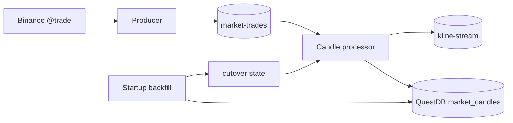

# NexTick Data Pipeline

`data_pipeline/` is NexTick's data write path. This Python module receives raw Binance trades, transports them through Kafka, creates OHLCV candles, runs startup backfill, and writes final `1m` candles to QuestDB.

It does not provide REST, Socket.IO, or a web user interface.

## Components

| File or area | Responsibility |
| --- | --- |
| `producer/binance_producer.py` | Connects Binance combined `@trade` streams, validates trades, and publishes them to Kafka. |
| `processor/candle_aggregator.py` | Buckets trades by symbol/interval, de-duplicates redelivered trade IDs, and finalizes expired candles. |
| `processor/candle_processor.py` | Consumes raw trades, publishes klines, writes final `1m` candles to QuestDB, and persists recovery state. |
| `processor/runner.py` | Real-time entrypoint with signal handling and a Compose healthcheck ready marker. |
| `backfill/runner.py` | Runs startup reconciliation once with retry and failure policy. |
| `backfill/reconciler.py` | Manual repair tool: fetches Binance REST data, verifies it, and replaces a closed `1m` data window. |
| `backfill/state.py` | Reads and writes the successful cutover that tells the processor when it may write. |
| `common/config.py` | Loads `data_pipeline/.env`, validates configuration, and resolves intervals. |

## Workflow



### Producer

The producer creates a combined stream from `TRADING_SYMBOLS`, for example `btcusdt@trade/ethusdt@trade`. Each valid trade is normalized to:

```json
{
  "symbol": "BTCUSDT",
  "trade_id": 123456,
  "timestamp": 1786358400123,
  "event_time": 1786358400456,
  "price": 100.5,
  "quantity": 0.25
}
```

Trades with missing fields, invalid IDs/timestamps, or non-positive price/quantity are discarded. The Kafka key is `symbol`, which keeps each symbol's trade order within one partition.

### Backfill and cutover

Startup backfill is enabled by default. It reads Binance time, chooses the next UTC minute as cutover `C`, waits for the currently open candle to close, then reconciles each symbol. The post-boundary grace defaults to two seconds through `STARTUP_RECONCILE_CLOSE_GRACE_SECONDS`:

- When QuestDB has a valid watermark `W`, it fetches `[max(W + 1 minute, C - 480 minutes), C)`.
- When no valid watermark exists, it fetches up to `STARTUP_RECONCILE_BOOTSTRAP_CANDLES` candles, capped at 480 minutes.
- `C` is an exclusive upper bound, so the open candle is never backfilled.

Shared state containing `cutover` is written atomically only after every symbol succeeds. The processor reads it at startup and discards all trades/candles before `C`, including recovered state and retry queues. This allows the producer to buffer trades in Kafka while preventing the processor from creating candles that overlap backfill.

If `STARTUP_RECONCILE_REQUIRED=true` (the default), exhausted backfill retries block processor startup. Set `STARTUP_RECONCILE_ENABLED=false` to skip all backfill work and leave no write fence.

### Processor

The processor creates candles for every configured `CANDLE_INTERVALS` value from raw trades. It batches open-candle publishing to roughly once per second; final candles are published as soon as their bucket closes. Kline payload:

```json
{
  "timestamp": "2026-08-10T08:00:00+00:00",
  "symbol": "BTCUSDT",
  "interval": "1m",
  "open": 100,
  "high": 102,
  "low": 99,
  "close": 101,
  "volume": 12.5,
  "is_final": true
}
```

The kline Kafka key is `symbol_interval`. Only final `1m` klines are upserted into QuestDB. The kline is published before its database write so the backend can still serve the real-time tail while the QuestDB WAL row is not yet visible.

Active candle state, Kafka publish retries, and database write retries are persisted atomically before Kafka offsets are committed. Under Compose, this state resides in the `pipeline_state` named volume, allowing a processor restart to resume an open candle.

## Run with Docker Compose

From the repository root:

```powershell
Copy-Item data_pipeline\.env.example data_pipeline\.env
docker compose up -d kafka kafka-ui kafka-setup questdb data-producer data-backfill data-processor
docker compose logs -f data-producer data-backfill data-processor
```

Compose builds the image automatically when no pipeline image exists. Use
`--build` only to force a rebuild after changing the pipeline image inputs:

```bash
docker compose up -d --build data-producer data-backfill data-processor
```

Compose uses `kafka:29092`, `questdb`, and state files under `/tmp/nextick` in the shared volume. Its dependency order is Kafka → topics/QuestDB → producer plus backfill → processor. The producer and backfill can start independently after infrastructure is ready; the processor waits for successful backfill completion.

## Run manually

Run only Kafka and QuestDB in Docker:

```bash
docker compose up -d kafka kafka-ui kafka-setup questdb
python -m venv .venv
```

In three separate PowerShell terminals:

```powershell
.\.venv\Scripts\Activate.ps1
pip install -r requirements.txt
python -m data_pipeline.producer.binance_producer
```

```powershell
.\.venv\Scripts\Activate.ps1
python -m data_pipeline.backfill.runner
```

```powershell
.\.venv\Scripts\Activate.ps1
python -m data_pipeline.processor.runner
```

When running manually, wait for backfill to finish before starting the processor to preserve the Compose workflow.

## Configuration

`data_pipeline/.env.example` includes local defaults.

| Group | Variables | Notes |
| --- | --- | --- |
| QuestDB | `QUESTDB_HOST`, `QUESTDB_PORT`, `QUESTDB_USER`, `QUESTDB_PASSWORD`, `QUESTDB_DB_NAME` | All are required. Local host is `localhost`; Compose host is `questdb`. |
| Kafka | `KAFKA_BROKER`, `KAFKA_TOPIC_MARKET_TRADES`, `KAFKA_TOPIC_KLINE_STREAM` | All are required. The Compose broker is `kafka:29092`. |
| Processor | `KAFKA_CONSUMER_GROUP_ID`, `KAFKA_AUTO_OFFSET_RESET` | Offset reset accepts only `earliest` or `latest`; invalid values fall back to `earliest`. |
| Binance | `BINANCE_SOCKET_URL`, `TRADING_SYMBOLS`, `CANDLE_INTERVALS` | `TRADING_SYMBOLS` and `CANDLE_INTERVALS` should not be blank. |
| Startup backfill | `STARTUP_RECONCILE_ENABLED`, `STARTUP_RECONCILE_REQUIRED`, `STARTUP_RECONCILE_MAX_ATTEMPTS`, `STARTUP_RECONCILE_RETRY_DELAY_SECONDS` | Both boolean flags default to `true` when unset or blank. |
| Additional backfill | `STARTUP_RECONCILE_SYMBOLS`, `STARTUP_RECONCILE_DRY_RUN`, `STARTUP_RECONCILE_KEEP_TEMP`, `STARTUP_RECONCILE_BINANCE_REST_URL`, `STARTUP_RECONCILE_TOLERANCE`, `STARTUP_RECONCILE_BOOTSTRAP_CANDLES`, `STARTUP_RECONCILE_WAIT_FOR_OPEN_CANDLE_CLOSE`, `STARTUP_RECONCILE_CLOSE_GRACE_SECONDS` | Affect startup reconciliation only. `STARTUP_RECONCILE_CLOSE_GRACE_SECONDS` defaults to `2`; use a larger value only when Binance data is not stable immediately after a minute boundary. |
| State | `STARTUP_BACKFILL_STATE_FILE`, `CANDLE_PROCESSOR_STATE_FILE`, `PROCESSOR_READY_FILE` | Compose provides shared-volume paths and health checks. |

`STARTUP_RECONCILE_WINDOW_HOURS` is deprecated and ignored. Startup uses each symbol's actual watermark rather than a fixed lookback window.

Supported intervals: `1m, 3m, 5m, 15m, 30m, 1h, 2h, 4h, 6h, 8h, 12h, 1d, 3d, 1w, 1M`.

## QuestDB

The processor creates this table when necessary:

```sql
CREATE TABLE IF NOT EXISTS market_candles (
  symbol SYMBOL,
  interval SYMBOL,
  timestamp TIMESTAMP,
  open DOUBLE,
  high DOUBLE,
  low DOUBLE,
  close DOUBLE,
  volume DOUBLE
) TIMESTAMP(timestamp)
PARTITION BY MONTH
DEDUP UPSERT KEYS(timestamp, symbol, interval);
```

QuestDB is written through its PostgreSQL wire protocol. The table is WAL/dedup enabled, so a repeated `(timestamp, symbol, interval)` key is upserted. Under normal operation, `data-processor` is the only live writer.

## Repair `1m` candles

`backfill.reconciler` is a maintenance tool, not a routine runtime step. It fetches Binance REST candles, validates continuity and values, creates a replacement table, verifies it, and swaps it into `market_candles`. It can restore the live table from a `market_candles_old_*` backup if a previous failed run left it missing.

Always stop the processor before repair:

```bash
docker compose stop data-processor
python -m data_pipeline.backfill.reconciler --dry-run
python -m data_pipeline.backfill.reconciler --symbols BTCUSDT,ETHUSDT
docker compose start data-processor
```

Useful options include `--bootstrap-candles 480`, `--keep-temp`, `--binance-rest-url`, and `--tolerance`.

## Verification

```bash
python -m unittest data_pipeline.tests.test_startup_backfill
python -m compileall data_pipeline
docker compose ps
```

## Architecture boundaries

- The pipeline communicates externally only with Binance, Kafka, and QuestDB.
- The backend owns REST, Swagger, and Socket.IO; the frontend communicates through the backend only.
- Future model or AI services should consume dedicated topics or tables rather than relying on in-memory processor state.
