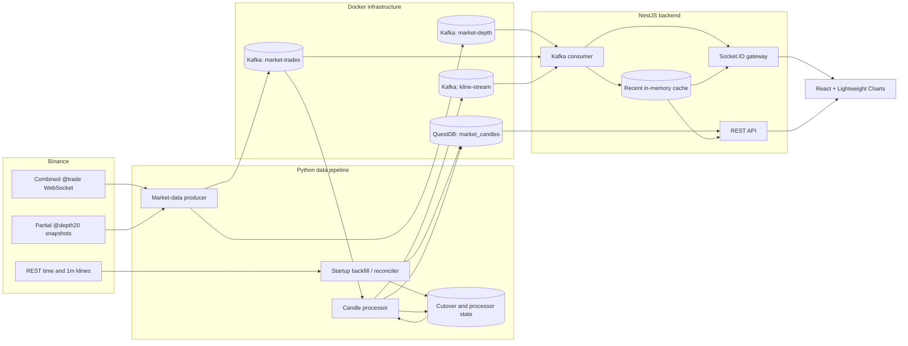
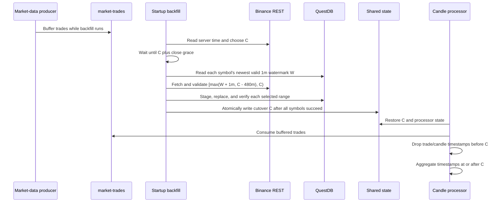

# NexTick System Architecture

This document is the authoritative description of NexTick's runtime design, cross-component contracts, reliability semantics, and architectural trade-offs. Component implementation details live in the [pipeline](../data_pipeline/README.md), [backend](../backend/README.md), and [frontend](../frontend/README.md) guides.

NexTick is a realtime market-data and charting system. Trading execution, portfolio management, forecasting, and financial advice are outside the implemented system.

## Non-Functional Goals

The repository does not define service-level objectives or benchmark targets. Its design nevertheless makes these priorities visible:

| Goal | Architectural support |
| --- | --- |
| Data correctness | Validated trade/candle inputs, a closed-candle backfill, an explicit cutover fence, QuestDB dedup keys, and complete-bucket filtering for most historical intervals |
| Transient-failure recovery | Kafka buffering, bounded retries, persisted processor state and retry maps, backend reconnect loops, and a reconciliation workflow |
| Low-latency chart updates | Direct trade aggregation, coalesced open-candle updates, Kafka kline delivery, Socket.IO rooms, and incremental chart updates |
| Deterministic historical/realtime ownership | Backfill owns candle timestamps before an exclusive cutover; the processor owns timestamps at or after it |
| Separation of responsibilities | Python owns exchange ingestion and candle writes, NestJS owns browser-facing contracts, and React owns rendering and interaction |
| Extensibility | Kafka topics and the canonical `1m` table are explicit integration boundaries for additional consumers |

These are design goals, not quantified guarantees.

## System Architecture



Docker Compose starts the infrastructure and Python services. The backend and frontend are intentionally not Compose services in the current repository; they run from their own directories.

## Component Boundaries

| Component | Owns | Does not own |
| --- | --- | --- |
| Python producer | Binance WebSocket connection, raw-trade/depth normalization, `market-trades` and `market-depth` publishing | Candle state, database writes, browser delivery |
| Startup backfill | Binance REST fetch, trailing `1m` reconciliation, cutover state | Continuous gap detection, arbitrary historical range repair |
| Python processor | Trade consumption, candle aggregation, kline publishing, final `1m` writes, local recovery state | REST, Socket.IO, UI state |
| Kafka | Durable asynchronous boundaries and partition ordering | End-to-end exactly-once semantics |
| QuestDB | Canonical final `1m` rows and time-bucket queries | Open candle state, browser access |
| NestJS backend | Query validation, QuestDB reads, Kafka kline/raw-trade/market-depth consumption, recent caches, REST and Socket.IO | Binance ingestion, canonical candle writes, chart rendering |
| React frontend | Historical/live merge, rendering, indicators, interaction, session preferences, Market Trades and Order Book views | Direct Binance, Kafka, or QuestDB access |

## End-to-End Data Flow

### Normal runtime

1. The producer subscribes to one Binance combined stream containing `@trade` and `@depth20@100ms` for every `TRADING_SYMBOLS` entry.
2. It validates and normalizes each event, then publishes trades to `KAFKA_TOPIC_MARKET_TRADES` and depth snapshots to `KAFKA_TOPIC_MARKET_DEPTH`, both keyed by uppercase symbol.
3. The processor consumes raw trades for candle aggregation, while the backend independently consumes them for Market Trades browser delivery.
4. Open candles are coalesced and normally published at most once per second. Final candles are published immediately to `KAFKA_TOPIC_KLINE_STREAM` with `symbol_interval` as the key.
5. Final `1m` candles are upserted into `market_candles`. Other final intervals are not persisted.
6. The backend consumes all three topics, normalizes them, updates bounded in-memory caches, and emits `kline_update`, `market_trade`, or `order_book_update` to matching Socket.IO rooms.
7. The frontend loads candle history over REST and joins backend kline, Market Trades, and Order Book rooms.

### Startup backfill and cutover

Let `C` be the next UTC minute boundary according to Binance server time when startup reconciliation begins.



For a symbol without a valid watermark, the start is `C - min(STARTUP_RECONCILE_BOOTSTRAP_CANDLES, 480 minutes)`. A valid but old watermark is also capped to the trailing 480 minutes. Backfill fetches a continuous, closed, minute-aligned Binance range and verifies OHLCV before replacing data.

The handoff invariant is:

- backfill may write candle timestamps in `[start, C)`;
- the processor rejects raw trades, recovered candles, publications, and retry writes with candle timestamps before `C`;
- the processor accepts timestamps at or after `C`.

This prevents overlapping ownership at startup. It does not prove that every post-cutover Binance trade reached Kafka: the producer has no readiness handshake with backfill and the Binance WebSocket is not replayable.

## Kafka Contracts

Compose disables topic auto-creation. `kafka-setup` creates all three configured topics with three partitions and replication factor `1`.

| Environment name | Example topic | Producer | Consumer | Kafka key |
| --- | --- | --- | --- | --- |
| `KAFKA_TOPIC_MARKET_TRADES` | `market-trades` | Python producer | Python processor and NestJS backend | `symbol` |
| `KAFKA_TOPIC_MARKET_DEPTH` | `market-depth` | Python producer | NestJS backend | `symbol` |
| `KAFKA_TOPIC_KLINE_STREAM` | `kline-stream` | Python processor | NestJS backend | `symbol_interval` |

Topic names are configuration, not hard-coded contracts. The payload shapes are code contracts and must change together across producers and consumers.

### Raw trade

```json
{
  "symbol": "BTCUSDT",
  "trade_id": 123456789,
  "timestamp": 1787558400123,
  "event_time": 1787558400150,
  "price": 105120.1,
  "quantity": 0.125,
  "is_buyer_maker": true
}
```

`timestamp` is Binance trade time in Unix milliseconds. `event_time` is preserved but not used by candle aggregation. `is_buyer_maker` lets the backend classify buyer- versus seller-initiated Market Trades without another Binance trade stream.

### Market depth

```json
{
  "symbol": "BTCUSDT",
  "last_update_id": 123456790,
  "bids": [[105120.1, 0.125]],
  "asks": [[105121.2, 0.25]]
}
```

Each message is a normalized Binance 20-level partial-depth snapshot. It is intended for the live Order Book panel, not for reconstructing a full exchange order book or durable replay.

### Kline update

```json
{
  "symbol": "BTCUSDT",
  "interval": "1m",
  "timestamp": "2026-08-24T08:00:00+00:00",
  "open": 105000.5,
  "high": 105250.75,
  "low": 104900.25,
  "close": 105120.1,
  "volume": 12.34567,
  "is_final": false
}
```

`timestamp` is the UTC bucket start. `is_final=false` is a mutable view of the active bucket; `is_final=true` means the processor closed that bucket. None of the three Kafka contracts carries a schema identifier or version field.

## Storage Model

The processor creates the live table through QuestDB's PostgreSQL wire protocol:

```sql
CREATE TABLE IF NOT EXISTS market_candles (
  symbol SYMBOL,
  interval SYMBOL,
  timestamp TIMESTAMP,
  open DOUBLE,
  high DOUBLE,
  low DOUBLE,
  close DOUBLE,
  volume DOUBLE
) TIMESTAMP(timestamp)
PARTITION BY MONTH
DEDUP UPSERT KEYS(timestamp, symbol, interval);
```

Only final `1m` candles are written during normal processing. The dedup key makes repeated writes for the same timestamp, symbol, and interval converge after QuestDB applies WAL records.

The reconciliation code validates that the live table is WAL/dedup enabled. If it finds an older non-WAL/non-dedup table, it can recreate it through a backup table before continuing. For a selected symbol range it stages Binance rows in a `BYPASS WAL` table, builds a full replacement excluding that range, takes a full backup, recreates the live WAL/dedup table, and verifies the replacement. This full-table copy/swap is why the processor must not write concurrently with reconciliation.

### Historical query behavior

`CandlesService` always reads canonical `1m` rows. It:

1. bounds the candidate query to at least 24 hours or twice the requested interval window;
2. filters invalid OHLCV rows;
3. groups each minute and accepts it only when one physical version is visible;
4. aggregates the stable minutes with `SAMPLE BY <interval> ALIGN TO CALENDAR`;
5. requires the expected number of one-minute rows for fixed-size buckets;
6. reverses the newest-first database result to oldest-first API order; and
7. merges the recent cache by timestamp before applying the requested limit.

`1M` is calendar-bucketed by QuestDB but does not use the fixed minute-count completeness filter because month length varies. The TypeScript interval-duration map uses 30 days only for query-window sizing and gap detection.

## REST and Realtime Architecture

### REST

| Method | Path | Behavior |
| --- | --- | --- |
| `GET` | `/` | Returns `Hello World!`; it is not a health check |
| `GET` | `/health` | Returns `200` only while both QuestDB and Kafka are marked available; otherwise returns `503` |
| `GET` | `/candles` | Returns historical candles plus the matching recent cache tail |
| `GET` | `/api/docs` | Swagger UI |

`GET /candles` requires `symbol`; `interval` defaults to `1m`; `limit` defaults to `100` and must be an integer from `1` through `2000`. The interval is allowlisted before it is interpolated into SQL, while symbol and time values use query parameters. The response is sorted oldest to newest.

### Socket.IO

| Event | Direction | Payload or effect |
| --- | --- | --- |
| `join_kline_room` | Client to server | `{ "symbol": "BTCUSDT", "interval": "1m" }`; joins `BTCUSDT_1m` and replays the cached room tail |
| `leave_kline_room` | Client to server | Same payload; leaves the room |
| `kline_update` | Server to client | Normalized kline update, including `is_final` |
| `join_market_trades_room` / `leave_market_trades_room` | Client to server | `{ "symbol": "BTCUSDT" }`; manages the selected raw-trade room |
| `market_trades_snapshot` / `market_trade` | Server to client | Cached tail and live normalized raw trades |
| `join_order_book_room` / `leave_order_book_room` | Client to server | `{ "symbol": "BTCUSDT" }`; manages the selected depth room |
| `order_book_snapshot` / `order_book_update` | Server to client | Latest cached and live normalized 20-level depth |

Room payloads are transformed and validated with NestJS pipes. The gateways accept WebSocket and polling transports. Socket.IO is a live notification path, not a durable replay log. Candle REST plus the candle cache provide bounded history/live convergence; Market Trades and Order Book joins receive only their process-local cached snapshots before continuing live.

## Data and Reliability Guarantees

NexTick combines at-least-once-style replay handling with idempotent or deduplicating boundaries. It does **not** implement a transactional exactly-once pipeline.

| Concern | Implemented semantics | Boundary or caveat |
| --- | --- | --- |
| Raw-trade ordering | `symbol` is the Kafka key, so accepted records for a symbol are ordered within its partition | No total order across partitions or symbols; order before Kafka depends on the live Binance connection |
| Market-depth ordering | `symbol` is the Kafka key and the backend cache rejects lower `lastUpdateId` values | Partial-depth snapshots are live/process-local and are not a durable full-book reconstruction |
| Kline ordering | `symbol_interval` is the key, so a series stays in one Kafka partition | Socket.IO delivery is not persisted or acknowledged by application code |
| Duplicate and late trades | The aggregator drops any `trade_id` less than or equal to the last accepted ID for that symbol | This assumes increasing trade IDs; a valid late record with an older ID is intentionally discarded |
| Candle construction | Trades update open/high/low/close and summed quantity inside UTC buckets | No synthetic zero-volume candle is created when no trade occurs |
| Candle finalization | A candle closes when a later bucket arrives or when its end is at least two seconds in the past | Open updates are coalesced to roughly one per second; delivery frequency is not guaranteed |
| Final versus non-final | Final updates are published immediately; retry maps do not replace a queued final update with a non-final one; the backend cache rejects non-final replacement of a final key | Live transport can still redeliver or reorder events; consumers must not infer exactly-once delivery from `is_final` |
| Processor offsets | Auto-commit is disabled. Approximately once per second, the processor atomically replaces its JSON state file, then calls `consumer.commit()` | State and Kafka offsets are not one transaction; a commit failure is logged and may cause replay |
| Processor recovery state | Active candles, finalized markers, last trade IDs, failed kline updates, and failed DB writes are persisted | The in-memory coalescing map for not-yet-broadcast open candles is not stored; files rely on the local/shared volume being intact |
| Publish retries | Kline sends wait for broker acknowledgement and retry four times before entering a persisted retry map | A crash can still duplicate a previously published kline when its trade is replayed |
| Database retries | Final `1m` writes retry three times, then enter a persisted retry map | Kafka publication occurs before the database write, so realtime can lead WAL visibility |
| QuestDB idempotency | WAL dedup/upsert keys are `(timestamp, symbol, interval)` | Dedup is applied by QuestDB, not atomically with Kafka offset commits; duplicate physical versions may be temporarily visible |
| Producer delivery | Kafka producer uses `acks=all`, client retries, and symbol keys | Asynchronous delivery failures are logged but not replayed from Binance; reconnect cannot recover missed trades, while later partial-depth snapshots replace the displayed depth view |
| Backfill ownership | State is written only after every selected symbol verifies; processor timestamps before the cutover are fenced | Completeness after the cutover depends on producer coverage; catch-up is capped at 480 minutes |
| Recent backend caches | Up to 500 candle timestamps per room, 160 trades per symbol, and one latest depth snapshot per symbol are retained | Caches are process-local and lost on backend restart; only the candle cache merges into REST history |
| Frontend out-of-order updates | Binary insertion keeps history sorted. Updates behind the tail trigger full candle/volume resynchronization while preserving the visible range | Same-timestamp updates replace unconditionally and frontend history does not retain finality, so final-over-non-final precedence is not enforced in the browser |
| Frontend gap recovery | A detected gap within the last 12 candles schedules REST merge attempts after 1, 2.5, 5, and 10 seconds | Initial history failure is not retried by this path, older gaps are not detected, and retries are bounded |

## Failure and Recovery Behavior

| Failure | Current response |
| --- | --- |
| Kafka unavailable when a Python client starts | Shared bounded exponential retry attempts client creation up to 60 times |
| Binance WebSocket closes | Producer retries up to 10 times with exponential delay capped at 300 seconds; Compose's `unless-stopped` policy can restart the container afterward |
| QuestDB unavailable when processor starts | Processor construction fails; the Compose container restart policy retries the process after QuestDB's startup wait |
| Kline publish or final `1m` write fails | Processor records the latest failed side effect in a keyed retry map and persists it in recovery state |
| Processor restarts | It restores aggregation and retry state, filters restored entries against the latest backfill fence, and resumes from the Kafka consumer group offset |
| Startup backfill fails | It retries according to environment settings. With `STARTUP_RECONCILE_REQUIRED=true`, the one-shot service exits unsuccessfully and Compose does not start the processor |
| Reconciliation swap fails | Code attempts to restore `market_candles` from the full backup and may retain failed/old tables for manual recovery |
| Backend starts without Kafka or QuestDB | The HTTP process starts, retries each dependency every five seconds, and reports `503` from `/health` until both are available |
| KafkaJS consumer crashes | KafkaJS may restart it under its retry policy; non-restartable failures trigger the backend reconnect loop |
| Browser Socket.IO transport disconnects | The client makes up to five reconnect attempts with a 1–5 second delay and rejoins active kline, Market Trades, and Order Book rooms |

The frontend reference-counts subscriptions and re-emits every active room join on a new Socket.IO connection.

## Security and Validation Boundaries

- Browsers connect only to the backend. Kafka, QuestDB, and Binance details are not exposed as frontend data sources.
- REST CORS allows the configured `FRONTEND_URL`. Socket.IO allows `FRONTEND_URL`, `BACKEND_URL`, or requests without an `Origin` header.
- REST DTO validation strips unknown properties, normalizes symbols to uppercase, allowlists intervals, and bounds `limit`. The service strips non-alphanumeric characters from symbols before querying.
- Kafka kline, raw-trade, and market-depth messages are parsed and normalized before reaching caches or gateways; identities, timestamps/IDs, OHLCV, sides, and depth levels are validated for their respective contracts.
- The producer and processor reject malformed identifiers, timestamps, non-positive prices/quantities, and invalid candle shapes.
- Reconciler SQL values are parameterized. Dynamic temporary table names are generated and checked against restricted identifier patterns.
- Current Kafka listeners are plaintext, QuestDB uses example local credentials, and the backend has no authentication, authorization, rate limiting, or application-level TLS. CORS is not an access-control substitute.

## Scalability Boundaries

- The local broker has three partitions per application topic, replication factor `1`, and two-hour log retention. It is a development topology, not a highly available Kafka cluster.
- One processor owns all active aggregation state. Although symbol keying places one symbol in one partition, adding consumer-group members can move a partition during rebalance; active candle state and JSON recovery files are not transferred between replicas.
- Backend replicas using the same `KAFKA_GROUP_ID` would divide partitions across all three consumed topics. Each process would then have only part of each cache and emit only its assigned messages. Horizontal scaling requires shared pub/sub or a different consumption design plus a Socket.IO adapter and connection-routing plan.
- QuestDB is a single local instance. The repository contains no replication, backup schedule, retention policy, or production failover plan.
- Reconciliation copies the full candle table for each selected symbol range before a swap. Its time and temporary-space cost grows with the table, and it requires a single-writer maintenance window.
- The recent cache is bounded by count, not time or memory budget, and is rebuilt only from new Kafka messages after a backend restart.

## Architecture Decisions and Trade-offs

The rationales below are inferred from the implemented boundaries. The repository contains no benchmark study comparing the alternatives.

### 1. Kafka between ingestion, processing, and backend

**Context.** Exchange ingestion, stateful aggregation, and browser delivery have different failure and restart behavior.

**Decision.** Use raw-trade and market-depth topics at the ingestion boundary, plus a kline topic between processor and backend.

**Why it fits NexTick.** Kafka lets the producer continue buffering while startup backfill runs, gives the processor consumer offsets for recovery, and keeps browser delivery out of the write path.

**Alternatives.** Direct in-process calls would be simpler for one process. Redis Streams, NATS JetStream, or RabbitMQ could also provide asynchronous boundaries.

**Trade-offs.** Components can restart independently and replay retained records, but local operation now requires a broker, schemas are informal JSON, retention is only two hours, and state/offset side effects are not transactional.

**Revisit when.** Reconsider the broker or topology if deployment simplicity matters more than replay, retention must grow substantially, schemas need governance, or measured workload exceeds the current partition model.

### 2. QuestDB for candle persistence

**Context.** Historical data is timestamped OHLCV and higher intervals require calendar-aligned time buckets.

**Decision.** Store candles in a QuestDB table with a designated timestamp, time partitions, WAL, and dedup keys.

**Why it fits NexTick.** The implemented queries use `SAMPLE BY`, first/last/min/max/sum aggregation, and time windows directly against the candle workload. PostgreSQL wire clients are available in both Python and Node.

**Alternatives.** PostgreSQL with TimescaleDB, ClickHouse, InfluxDB, or plain PostgreSQL tables are plausible. No comparative benchmark is present.

**Trade-offs.** Time-bucket SQL and dedup are concise, but the code depends on QuestDB-specific SQL and WAL behavior, and the current deployment is one unpinned local instance.

**Revisit when.** Reevaluate if operational support, replication, joins with relational data, retention management, or workload measurements favor another store.

### 3. Python for ingestion and candle processing

**Context.** The pipeline needs WebSocket and REST access, Kafka clients, stateful aggregation, validation, and maintenance scripting.

**Decision.** Implement the producer, processor, and reconciler as Python modules in one small container image.

**Why it fits NexTick.** The current logic is straightforward I/O plus per-trade arithmetic, and the selected Python libraries cover Binance connectivity, Kafka, and QuestDB's PostgreSQL wire protocol with little framework overhead.

**Alternatives.** Node.js, Java/Kotlin, Go, or a stream-processing framework could own the same path.

**Trade-offs.** Python keeps the implementation approachable and repair tooling reusable, but the current process is single-threaded, state is local JSON, and `kafka-python` is pinned to an older client.

**Revisit when.** Reconsider if profiling shows CPU or client limitations, partition-parallel processing is required, or state must move to a distributed stream processor.

### 4. Separate NestJS backend and Python pipeline

**Context.** Exchange-facing writes and browser-facing reads have different APIs, dependencies, and security boundaries.

**Decision.** Keep ingestion and persistence in Python while NestJS owns REST, health, validation, Swagger, Kafka consumption, and Socket.IO.

**Why it fits NexTick.** A pipeline restart does not require restarting the HTTP application, and the browser API can evolve without adding request handling to the stateful processor.

**Alternatives.** A single Node or Python service would reduce process count; separate read and realtime services would split it further.

**Trade-offs.** Responsibilities are clear, but local setup uses three language/runtime processes and shared JSON contracts can drift without generated schemas.

**Revisit when.** Consolidate if operational overhead dominates, or split further if API and realtime delivery need independent scaling.

### 5. REST for history and Socket.IO for realtime updates

**Context.** A chart needs an ordered snapshot at load time and small updates while it remains open.

**Decision.** Fetch history with `GET /candles` and receive live kline changes through room-scoped Socket.IO events.

**Why it fits NexTick.** REST provides a retryable snapshot and query parameters; Socket.IO supports long-lived delivery, rooms, reconnection transports, and a small frontend client.

**Alternatives.** Polling alone, Server-Sent Events, GraphQL subscriptions, or a raw WebSocket protocol could serve the UI.

**Trade-offs.** The two-path design keeps snapshot and update concerns explicit, but clients must merge them correctly, Socket.IO events are not durable, and room membership must be restored after reconnect.

**Revisit when.** Consider another protocol if bidirectional room control is unnecessary, delivery acknowledgement is required, or a public API needs protocol stability beyond Socket.IO.

### 6. Browsers isolated from Kafka and QuestDB

**Context.** Broker and database protocols are not suitable public browser contracts, and their credentials and topology should not be client concerns.

**Decision.** The frontend communicates only with NestJS.

**Why it fits NexTick.** The backend centralizes validation, query limits, CORS, cache merging, and translation from Kafka events to per-market rooms.

**Alternatives.** A managed database HTTP API or broker WebSocket gateway could expose infrastructure more directly.

**Trade-offs.** Infrastructure stays replaceable behind one API boundary, but the backend is another availability and scaling layer.

**Revisit when.** Reconsider only with a deliberately secured public data gateway and a clear replacement for backend validation and aggregation policy.

### 7. Final `1m` candles as canonical history

**Context.** Storing every configured interval duplicates the same market history and complicates corrections.

**Decision.** Persist only closed `1m` candles; open candles and higher intervals remain streaming data.

**Why it fits NexTick.** One-minute rows preserve enough granularity for every currently supported historical interval and give reconciliation one canonical key per minute.

**Alternatives.** Persist every interval, store raw trades, or maintain materialized rollups.

**Trade-offs.** Corrections and storage are simpler, but historical queries spend compute aggregating `1m` rows, raw trade replay is impossible after Kafka retention, and sub-minute views cannot be derived.

**Revisit when.** Add raw storage or rollups if audit/replay requirements emerge or measured query cost becomes material.

### 8. Derive higher historical intervals

**Context.** Users select intervals from `1m` through `1M`, while realtime updates should still arrive without waiting for a database query.

**Decision.** Aggregate configured higher intervals directly from trades for realtime publication, but derive historical higher intervals from canonical `1m` rows in QuestDB.

**Why it fits NexTick.** Live charts receive immediate higher-bucket changes while refreshes converge on one persisted source.

**Alternatives.** Persist each final interval, calculate all intervals in the browser, or use database materialized views.

**Trade-offs.** It avoids redundant historical tables, but live and historical values travel through different calculation paths. Fixed buckets require complete `1m` counts, while `1M` needs special handling.

**Revisit when.** Persist or materialize popular intervals if query latency or database load is measured as unacceptable.

### 9. Startup backfill/realtime cutover

**Context.** Starting aggregation mid-minute would create a partial candle, while pausing ingestion during REST backfill could lose trades after the backfill window.

**Decision.** Start the producer, choose a future closed-minute boundary `C`, backfill through `[start, C)`, persist `C`, then let the processor drain Kafka while rejecting timestamps before `C`.

**Why it fits NexTick.** It gives each candle timestamp one owner and includes the minute that was open when backfill started.

**Alternatives.** Start realtime immediately and patch overlaps, pause the exchange feed, or replay from a durable exchange/raw-trade archive.

**Trade-offs.** Ownership is deterministic and startup gaps are bounded, but startup waits up to roughly a minute plus grace, catch-up is capped at eight hours, and producer readiness is not coordinated with `C`.

**Revisit when.** Extend the design when downtime can exceed retention/backfill caps or when producer readiness and complete post-cutover coverage must be proven.

### 10. Persist processor recovery state

**Context.** Kafka offsets alone cannot reconstruct the exact active candle if side effects and an offset checkpoint occur at different times.

**Decision.** Atomically replace a local JSON snapshot containing active candles, finalized markers, last trade IDs, and failed side effects before committing offsets.

**Why it fits NexTick.** The single processor can resume an open bucket and suppress replayed trade IDs without introducing another state service.

**Alternatives.** Kafka Streams/Flink state stores, compacted changelog topics, Redis, or recomputation from a longer raw-trade log.

**Trade-offs.** Recovery is simple for one Compose replica, but the file and offset are not one transaction, state cannot move safely between replicas, and loss of `pipeline_state` removes this protection.

**Revisit when.** Move state to partition-owned durable storage before horizontal processor scaling or stronger recovery guarantees.

### 11. Maintain recent realtime caches in the backend

**Context.** A final kline can reach the backend before the QuestDB WAL write is visible, and new Socket.IO subscribers need a useful current candle/trade/depth view.

**Decision.** Keep up to 500 normalized candle updates per `SYMBOL_interval`, 160 raw trades per symbol, and the latest depth snapshot per symbol. Merge candle cache entries into REST history and send the relevant cached data when a client joins each room type.

**Why it fits NexTick.** It closes the common publication/database visibility gap without making REST wait for WAL application and gives the live side panels an immediate process-local snapshot.

**Alternatives.** Query Kafka, persist open candles, delay realtime publication, or use a shared cache.

**Trade-offs.** Refreshes converge quickly on recent updates, but memory is process-local, cold after restart, and inconsistent across replicas. Trades and depth have no historical REST fallback.

**Revisit when.** Introduce a shared cache or fan-out layer when multiple backend instances or longer replay windows are required.

### 12. Lightweight Charts for the UI

**Context.** The frontend needs candlesticks, volume, multiple panes, crosshair interaction, incremental updates, and explicit control over series synchronization.

**Decision.** Build the chart with Lightweight Charts and calculate indicators in TypeScript.

**Why it fits NexTick.** The source uses its candlestick/line series, pane API, logical ranges, and `update`/`setData` distinction directly, without a larger dashboard framework.

**Alternatives.** Apache ECharts, Highcharts Stock, Plotly, D3, or a custom canvas layer could provide different feature and licensing trade-offs.

**Trade-offs.** The UI has fine-grained chart control and a small domain model, but NexTick owns indicator math, pane state, out-of-order resync, and preference validation itself.

**Revisit when.** Reevaluate if required drawing tools, accessibility, indicator breadth, or measured rendering scale exceed the current library and custom code.

## Known Architectural Limitations

| Current implementation | Limitation | Future possibility |
| --- | --- | --- |
| Single KRaft broker, plaintext listeners, replication factor `1`, two-hour retention | Broker loss or a long outage can remove replay coverage | Multi-broker secured Kafka with explicit retention and backup policy |
| `questdb/questdb:latest` on one named volume | Rebuilds are not reproducible and there is no database failover | Pin a tested version and document backup/restore and replication strategy |
| One processor with local JSON state | Consumer-group scale-out can split or move stateful partitions incorrectly | Partition-owned distributed state or a stream-processing runtime |
| Process-local backend cache and Socket.IO server | Replicas do not share cache entries, Kafka messages, or rooms | Shared pub/sub/cache and Socket.IO adapter with connection routing |
| No authentication, authorization, rate limiting, or TLS termination | Exposed deployments would have weak access controls | Add an authenticated edge/API policy and secured infrastructure listeners |
| Startup backfill follows the newest valid watermark and stops at 480 minutes | Older holes and valid-but-wrong rows can remain undetected | Explicit range repair and scheduled integrity scans |
| Live Binance WebSocket with no raw-trade archive | Disconnect gaps cannot be replayed from NexTick | Durable raw-trade retention or continuous closed-candle reconciliation |
| Frontend same-timestamp merge ignores finality | A late non-final event can replace a final chart value until another refresh/update | Track `is_final` and enforce final precedence |
| No committed backend TypeScript specs and no frontend test runner | Backend, cross-service, and UI regressions are weakly protected | Restore unit/e2e coverage and add contract, integration, failure-recovery, and browser tests |
| Logs only; no metrics or tracing backend | Health and data-quality trends are not observable over time | Structured metrics, traces, dashboards, and alerting |
| Local Compose plus separate dev servers | No verified production topology or release procedure | Versioned images, CI gates, deployment manifests, and rollback documentation |
