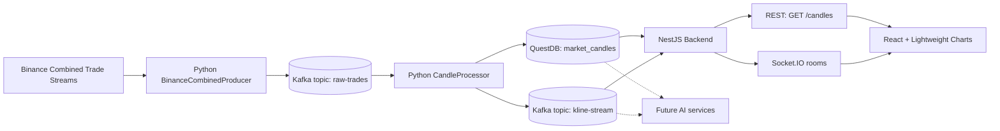
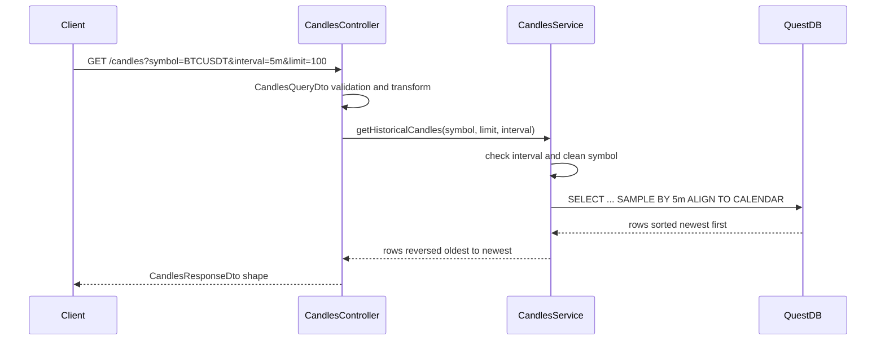
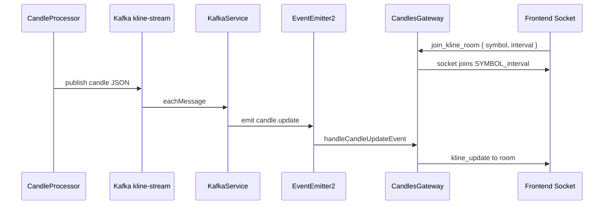

# NexTick Architecture

NexTick is built as a clear market data pipeline. Binance trades go into Kafka. A Python processor builds OHLCV candles. Final `1m` candles are stored in QuestDB. A NestJS backend serves history and live updates. A React frontend shows the chart.

## System Diagram



## Runtime Boundaries

| Boundary | Owner | What it does |
| --- | --- | --- |
| Binance WebSocket -> raw Kafka | `data_pipeline/producer/binance_producer.py` | Connects to Binance, checks price and volume, creates clean raw trade messages. |
| Raw Kafka -> candle state | `data_pipeline/processor/candle_processor.py` | Reads raw trades and updates candle state by symbol and interval. |
| Candle state -> QuestDB | `CandleProcessor.save_to_db()` | Saves final `1m` candles to `market_candles`. |
| Candle state -> kline Kafka | `CandleProcessor.broadcast_candle()` | Sends final and open candles to `KAFKA_TOPIC_KLINE_STREAM`. |
| Kline Kafka -> app event | `backend/src/modules/kafka/kafka.service.ts` | Reads kline messages, parses JSON, emits `candle.update`. |
| App event -> Socket.IO | `backend/src/modules/candles/candles.gateway.ts` | Sends `kline_update` to room `{SYMBOL}_{interval}`. |
| QuestDB -> REST | `backend/src/modules/candles/candles.service.ts` | Reads and groups candle history with QuestDB SQL. |
| REST/Socket.IO -> chart | `frontend/src/hooks/useMarketData.ts` | Loads history, joins rooms, and updates Lightweight Charts series. |

## Data Pipeline Layer

### Binance Producer

`BinanceCombinedProducer` reads symbols from `TRADING_SYMBOLS`. It lowercases them to build a Binance combined stream URL:

```text
wss://stream.binance.com:9443/stream?streams=btcusdt@trade/ethusdt@trade
```

Each trade is cleaned into this shape:

```json
{
  "symbol": "BTCUSDT",
  "trade_id": 123456789,
  "timestamp": 1779254400000,
  "price": 105000.5,
  "volume": 0.125,
  "is_buyer_maker": false
}
```

The producer sends the message to `KAFKA_TOPIC_RAW_TRADES`. The Kafka key is `symbol`. It retries when Kafka is not ready, reconnects when Binance drops the socket, and drops trades with `price <= 0` or `volume <= 0`.

### Candle Processor

`CandleProcessor` reads `KAFKA_TOPIC_RAW_TRADES` with group id `candle-processor-group`. Each symbol gets one `MultiTimeframeManager`. Each interval inside it uses one `SingleCandleManager`.

The candle update is O(1), which means one trade updates the active candle without scanning old trades.

| Field | Update rule |
| --- | --- |
| `open` | Set once when a new candle starts. |
| `high` | `max(current_high, trade_price)`. |
| `low` | `min(current_low, trade_price)`. |
| `close` | Latest trade price. |
| `volume` | Add trade volume to current volume. |

The processor does not keep a full trade history for the active candle. When a trade moves into a new interval, the old candle becomes final and is sent with `is_final=true`.

### Supported Intervals

The pipeline and backend use the same interval list:

```text
1m, 3m, 5m, 15m, 30m, 1h, 2h, 4h, 6h, 8h, 12h, 1d, 3d, 1w, 1M
```

In `data_pipeline/config.py`, `get_timeframes_with_ms()` checks `CANDLE_INTERVALS`. In the backend, `VALID_INTERVALS` checks REST query values and Socket.IO room payloads.

## Storage

QuestDB stores historical candles. The processor creates this table:

```sql
CREATE TABLE IF NOT EXISTS market_candles (
  symbol SYMBOL,
  interval SYMBOL,
  timestamp TIMESTAMP,
  open DOUBLE,
  high DOUBLE,
  low DOUBLE,
  close DOUBLE,
  volume DOUBLE
) TIMESTAMP(timestamp) PARTITION BY MONTH BYPASS WAL;
```

Current storage rules:

| Rule | Details |
| --- | --- |
| Table | `market_candles`. |
| Saved interval | Only final `1m` candles are inserted into QuestDB by `broadcast_candle()`. |
| Larger history intervals | The backend builds them from `interval = '1m'` with `SAMPLE BY ${interval} ALIGN TO CALENDAR`. |
| Insert timestamp | The processor uses `%Y-%m-%d %H:%M:%S`. |
| API timestamp | The backend returns ISO 8601 strings. |

QuestDB `SAMPLE BY` needs the interval as SQL text, not a normal query parameter. Because of that, the backend must check the interval against `VALID_INTERVALS` before putting it into SQL.

## Backend

The NestJS backend has 3 main modules:

| Module | Main files | Role |
| --- | --- | --- |
| `CandlesModule` | `candles.controller.ts`, `candles.service.ts`, `candles.gateway.ts` | REST candles, history queries, Socket.IO rooms. |
| `DatabaseModule` | `database.service.ts` | Manages `pg.Pool` for the QuestDB PostgreSQL connection. |
| `KafkaModule` | `kafka.service.ts` | KafkaJS consumer for `KAFKA_TOPIC_KLINE_STREAM`. |

### App Startup

`backend/src/main.ts`:

1. Loads `.env` through `ConfigModule`.
2. Enables global `ValidationPipe` with `whitelist: true` and `transform: true`.
3. Enables shutdown hooks.
4. Sets REST CORS from `FRONTEND_URL`.
5. Creates Swagger docs at `/api/docs`.
6. Starts the server on `PORT`.

### REST Query Path



Current query in `CandlesService`:

```sql
SELECT 
  timestamp,
  symbol,
  '${interval}' AS interval,
  first(open) AS open,
  max(high) AS high,
  min(low) AS low,
  last(close) AS close,
  sum(volume) AS volume
FROM market_candles
WHERE symbol = $1 AND interval = '1m'
SAMPLE BY ${interval} ALIGN TO CALENDAR
ORDER BY timestamp DESC
LIMIT $2;
```

`symbol` and `limit` use query parameters. `symbol` is also uppercased and stripped to `[A-Z0-9]`.

### Live Update Path



Room format:

```text
{SYMBOL}_{interval}
```

Example:

```text
BTCUSDT_1m
```

Socket.IO events:

| Event | Direction | Payload |
| --- | --- | --- |
| `join_kline_room` | Client -> server | `{ "symbol": "BTCUSDT", "interval": "1m" }` |
| `leave_kline_room` | Client -> server | `{ "symbol": "BTCUSDT", "interval": "1m" }` |
| `kline_update` | Server -> client | `KlineUpdateDto`, with candle fields and `is_final`. |

Gateway CORS allows `BACKEND_URL`, `FRONTEND_URL`, or requests without an `origin`.

## Frontend

The frontend is a Vite React app. `App.tsx` renders `MainLayout` and `TradingChart`.

| File | Role |
| --- | --- |
| `src/components/chart/TradingChart.tsx` | Stores selected symbol, interval, legend state, indicator visibility, and chart refs. |
| `src/components/chart/useTradingChartSetup.ts` | Creates Lightweight Charts, candle series, volume series, indicator series, crosshair handling, and resize handling. |
| `src/hooks/useMarketData.ts` | Fetches history, calls `setData`, joins/leaves Socket.IO rooms, applies live updates. |
| `src/services/api.ts` | Calls `GET /candles` with Axios. |
| `src/services/socket.ts` | Creates the Socket.IO client and room helper functions. |
| `src/utils/formatters.ts` | Parses time and number values, formats tooltip time and chart values. |
| `src/utils/indicators.ts` | Calculates EMA and MA values. |
| `src/components/chart/chartConstants.ts` | Stores chart colors, spacing, indicator periods, and env-based symbol/interval lists. |

### Chart Update Strategy

The frontend uses different chart calls for history and live data:

| Case | Lightweight Charts call |
| --- | --- |
| First history load | `candlestickSeries.setData()` and `volumeSeries.setData()`. |
| Symbol or interval change | Clear series, fetch history again, then call `setData()`. |
| Live candle update | `candlestickSeries.update()` and `volumeSeries.update()`. |

`useMarketData` keeps `candleHistoryRef` so it can replace the latest candle or append a new one. It also updates volume data for the tooltip and recalculates EMA/MA points.

## Time Format Rules

| Boundary | Format |
| --- | --- |
| Binance trade | Milliseconds since Unix epoch from field `T`. |
| Python processor | UTC `datetime.fromtimestamp(ms / 1000.0, tz=timezone.utc)`. |
| Kafka kline | ISO 8601 from `datetime.isoformat()`, for example `2026-05-20T08:00:00+00:00`. |
| QuestDB insert | String `%Y-%m-%d %H:%M:%S`. |
| Backend response | ISO 8601, for example `2026-05-20T08:00:00.000Z`. |
| Frontend chart | Unix seconds for Lightweight Charts. |

Do not pass unclear local datetimes between layers. If a timestamp is invalid or too old, the processor skips the record.

## Failure Handling

| Part | Behavior |
| --- | --- |
| Producer Kafka startup | Retries with backoff until Kafka is ready or retries are used up. |
| Producer Binance socket | Reconnects with backoff until `max_reconnect_attempts`. |
| Processor Kafka startup | Retries with backoff. |
| Processor DB insert | Retries the insert and commits the Kafka offset after the insert succeeds. |
| Processor final publish | If final `1m` save fails, it does not publish that final candle. |
| Backend DB startup | Runs `SELECT 1`; startup fails if QuestDB is not reachable. |
| Backend Kafka startup | Startup fails if the consumer cannot connect or subscribe. |
| Frontend history load | Logs the error. If history loading fails before room join, it does not join the room. |

## Scaling Notes

| Area | Note |
| --- | --- |
| Kafka partitions | Topics are created with 3 parts. Producers use symbol as key to keep order for each symbol. |
| More backend instances | Live Socket.IO updates can run on more backend nodes, but they will need a shared Socket.IO adapter. |
| More processors | Processors need a clear rule for which symbol or Kafka part each one handles, so two processors do not build the same symbol candles. |
| QuestDB storage | Data is split by month. Final `1m` candles are the source for larger intervals. |
| AI services | Future AI services should read from Kafka or QuestDB and write to their own topics or tables. They should not run inside the API request path. |

## Security and Validation

| Layer | Current protection |
| --- | --- |
| REST query | `CandlesQueryDto` checks `symbol`, `interval`, and `limit`; global `ValidationPipe` uses whitelist and transform. |
| Socket room payload | `KlineRoomPayloadDto` checks `symbol` and interval. |
| SQL values | `symbol` and `limit` use query parameters. |
| SQL interval text | Interval is inserted only after it passes `VALID_INTERVALS`. |
| Browser CORS | REST CORS uses `FRONTEND_URL`; Socket.IO CORS uses `BACKEND_URL` and `FRONTEND_URL`. |

## Data Shapes That Must Stay in Sync

When you change symbols, intervals, topics, or payloads, update all related places.

| Change | Places to check |
| --- | --- |
| Add an interval | `data_pipeline/config.py`, `backend/src/modules/candles/enum/candle-interval.enum.ts`, `frontend/.env`, `data_pipeline/.env`. |
| Add a default symbol | `data_pipeline/.env`, `frontend/.env`. |
| Change Kafka topics | `data_pipeline/.env`, `backend/.env`, `docker-compose.yml` service `kafka-setup`. |
| Change candle payload | Python `broadcast_candle`, backend DTOs, frontend `MarketCandle` and `KlineUpdate`. |
| Change QuestDB schema | Processor table creation and insert, backend SQL, docs, and migration plan if data already exists. |
