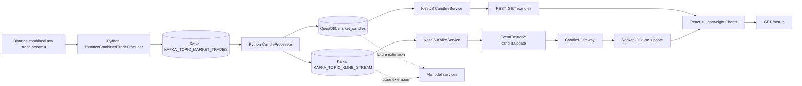
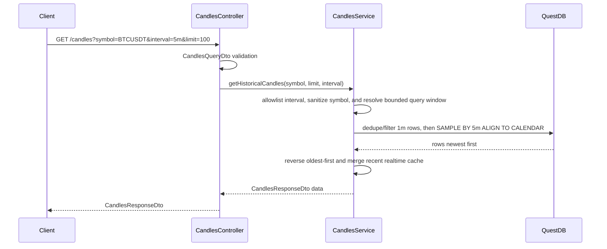
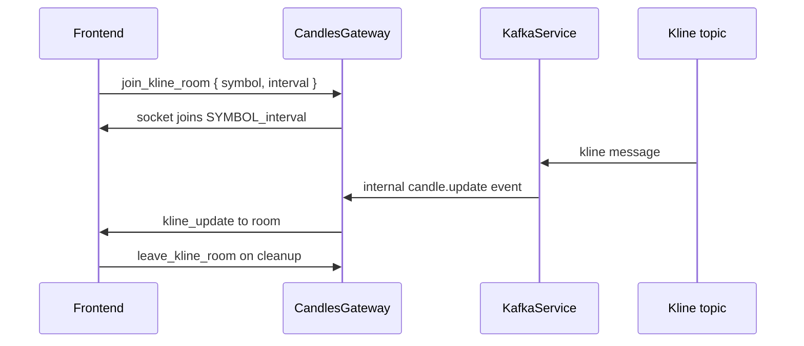

# NexTick Architecture

NexTick is a realtime market-data system with explicit runtime boundaries.

Binance raw trades enter the Python pipeline, where candles are aggregated before Kafka output to the backend. QuestDB stores final `1m` candles, NestJS exposes validated API contracts, and React renders the chart. AI forecasting, replay buffers, model training, and online learning are future extensions only.

## System Diagram



## Runtime Boundaries

| Boundary | Owner | Contract |
| --- | --- | --- |
| Binance to market-trade Kafka | Python producer | Normalized Binance raw-trade JSON in `KAFKA_TOPIC_MARKET_TRADES`. |
| Market-trade Kafka to processor | Python processor | `CandleProcessor` consumes trades and aggregates candles. |
| Processor to QuestDB | Python processor | Final `1m` candles upserted into `market_candles`. |
| Processor to kline Kafka | Python processor | Final and non-final candle JSON in `KAFKA_TOPIC_KLINE_STREAM`. |
| QuestDB to REST | NestJS backend | `GET /candles` response DTO, with valid OHLCV filtering and recent realtime tail merge. |
| Kline Kafka to Socket.IO | NestJS backend | `candle.update` internal event to `kline_update` room broadcast. |
| REST/Socket.IO to chart | React frontend | Axios history load and Socket.IO realtime updates. |

## Data Pipeline Layer

### Producer

`data_pipeline/producer/binance_producer.py` runs `BinanceCombinedTradeProducer`.

Current behavior:

1. Reads `BINANCE_SOCKET_URL` and `TRADING_SYMBOLS` from config.
2. Lowercases configured symbols for Binance stream names.
3. Builds a combined raw trade stream URL from `BINANCE_SOCKET_URL`, like:

```text
wss://stream.binance.com:9443/stream?streams=btcusdt@trade/ethusdt@trade
```

4. Converts Binance payloads into the market raw-trade input contract.
5. Drops invalid trades with invalid timestamp, price, or quantity.
6. Publishes to `KAFKA_TOPIC_MARKET_TRADES` with `symbol` as the Kafka key.
7. Reconnects to Binance with exponential backoff when the WebSocket drops.

### Processor

`data_pipeline/processor/candle_processor.py` runs `CandleProcessor`.

Current behavior:

1. Connects to QuestDB through PostgreSQL wire protocol.
2. Creates `market_candles` as a WAL/dedup table if it does not exist.
3. Consumes `KAFKA_TOPIC_MARKET_TRADES` with group id `candle-processor-group` by default.
4. Aggregates raw trade price and quantity into every configured interval.
5. Drops candles before the successful startup cutover from persistence, publication, and retry paths.
6. Publishes final and non-final candles to `KAFKA_TOPIC_KLINE_STREAM` before persisting final `1m` candles.
7. Persists final `1m` candles only and retries failed upserts without withholding realtime output.

## Kafka Topics

| Topic env | Current producer | Current consumer | Message shape |
| --- | --- | --- | --- |
| `KAFKA_TOPIC_MARKET_TRADES` | Python producer | Python processor | Binance raw-trade JSON. |
| `KAFKA_TOPIC_KLINE_STREAM` | Python processor | NestJS backend | Candle JSON plus `is_final`. |

Docker Compose creates both topics in `kafka-setup` using values from `data_pipeline/.env`. Each topic is created with 3 partitions and replication factor `1`.

## Data Shapes

### Market Trade Input

```json
{
  "symbol": "BTCUSDT",
  "trade_id": 123456789,
  "timestamp": 1779254400123,
  "event_time": 1779254460123,
  "price": 105120.1,
  "quantity": 0.125
}
```

### Kline Update

```json
{
  "timestamp": "2026-05-20T08:00:00+00:00",
  "symbol": "BTCUSDT",
  "interval": "1m",
  "open": 105000.5,
  "high": 105250.75,
  "low": 104900.25,
  "close": 105120.1,
  "volume": 12.34567,
  "is_final": false
}
```

### REST Candle Response

```json
{
  "success": true,
  "symbol": "BTCUSDT",
  "interval": "1m",
  "count": 1,
  "data": [
    {
      "timestamp": "2026-05-20T08:00:00.000Z",
      "symbol": "BTCUSDT",
      "interval": "1m",
      "open": 105000.5,
      "high": 105250.75,
      "low": 104900.25,
      "close": 105120.1,
      "volume": 12.34567
    }
  ]
}
```

These shapes must stay in sync across Python publishing, backend DTOs, and frontend formatters.

## QuestDB Storage Model

The processor creates this table:

```sql
CREATE TABLE IF NOT EXISTS market_candles (
  symbol SYMBOL,
  interval SYMBOL,
  timestamp TIMESTAMP,
  open DOUBLE,
  high DOUBLE,
  low DOUBLE,
  close DOUBLE,
  volume DOUBLE
) TIMESTAMP(timestamp)
PARTITION BY MONTH
DEDUP UPSERT KEYS(timestamp, symbol, interval);
```

Current storage rules:

| Rule | Current behavior |
| --- | --- |
| Stored interval | Final `1m` candles only. |
| Historical larger intervals | Built by backend SQL using QuestDB `SAMPLE BY`. |
| Table partitioning | Monthly. |
| Timestamp column | Designated QuestDB timestamp. |
| Insert path | Python processor plus startup/manual REST replacement reconciler. |

Maintenance reconciliation is handled by `data_pipeline.backfill.reconciler`. In
Docker startup, `data-producer` begins buffering Binance raw trades after the
Kafka topics exist, while `data-backfill` runs after QuestDB is healthy.
`data-backfill` is enabled by default and calls Binance `/api/v3/time` to choose
the next UTC minute after startup as shared cutover `C`. It waits until the
startup minute has closed and is stable, then independently catches each symbol
up from valid watermark `W` over `[max(W + 1 minute, C - 480 minutes), C)`.
Empty symbols bootstrap at most the preceding 480 closed minutes. After all ranges verify, the service writes
the shared cutover state; while draining Kafka, the processor drops every candle
timestamp before `C` from QuestDB writes, publication, and retry queues.
Repairs use the startup/manual replacement reconciler while the live processor
is stopped, so a bounded window is rebuilt and swapped instead of being patched
by a second live writer.

## Backend Layer

NestJS modules:

| Module | Role |
| --- | --- |
| `CandlesModule` | `GET /candles`, `CandlesService`, recent candle cache, validation helpers, and Socket.IO gateway. |
| `DatabaseModule` | `pg.Pool` connection to QuestDB. |
| `KafkaModule` | KafkaJS kline consumer. |

`RecentCandlesCacheService` stores up to 500 normalized kline updates per
`SYMBOL_interval` room. New Socket.IO subscribers receive the cached tail, and
`GET /candles` merges the same cache into QuestDB history so the API can include
the newest realtime candle before the final `1m` write is visible in QuestDB.

REST endpoints:

| Method | Path | Description |
| --- | --- | --- |
| `GET` | `/` | Returns `Hello World!`. |
| `GET` | `/health` | Returns status and timestamp. |
| `GET` | `/candles` | Returns historical candles. |

Swagger is available at:

```text
/api/docs
```

### REST Query Path



### Socket.IO Path



Socket.IO events:

| Event | Direction | Payload |
| --- | --- | --- |
| `join_kline_room` | Client to server | `{ "symbol": "BTCUSDT", "interval": "1m" }` |
| `leave_kline_room` | Client to server | `{ "symbol": "BTCUSDT", "interval": "1m" }` |
| `kline_update` | Server to client | Kline update JSON. |

## Frontend Layer

The frontend is a Vite React app.

Key files:

| File | Role |
| --- | --- |
| `src/App.tsx` | Selects `/`, `/terms`, or `/privacy` based on `window.location.pathname`. |
| `src/services/api.ts` | Calls `GET {VITE_API_URL}/candles`. |
| `src/services/socket.ts` | Creates Socket.IO client and room helpers. |
| `src/hooks/useMarketData.ts` | Loads history, joins/leaves rooms, applies realtime candles, repairs recent tail gaps, and syncs indicators. |
| `src/components/chart/TradingChart.tsx` | Composes chart controls, chart container, overlays, and indicator legend. |
| `src/components/chart/chartPreferences.ts` | Loads, validates, saves, and resets session-scoped chart preferences. |
| `src/components/chart/useTradingChartState.ts` | Owns chart refs, selected market, indicator settings, and chart UI state. |
| `src/components/chart/useTradingChartSetup.ts` | Creates Lightweight Charts series, crosshair behavior, pane layout tracking, and visible high/low overlay data. |
| `src/components/indicators/IndicatorLegend.tsx` | Displays indicator values and settings window. |
| `src/components/indicators/indicatorSettingsModel.ts` | Indicator settings tabs, slot defaults, pane placement helpers, and settings-window positioning. |
| `src/utils/indicatorSettings.ts` | Clones, merges, and compares indicator setting collections. |
| `src/utils/chartIndicators.ts` | Maps indicator settings and series configs to calculated chart values. |
| `src/components/layout/useApiHealthStatus.ts` | Checks `VITE_API_HEALTH_URL` and returns API status for the footer. |

Chart update rules:

| Case | API |
| --- | --- |
| Historical load | `setData()` for candles, volume, and indicator series. |
| Symbol or interval switch | Clear series, fetch history, then `setData()`. |
| Realtime candle | `update()` for candle and volume series. |
| Out-of-order realtime candle | Merge by timestamp and refresh candle/volume series with `setData()` while preserving visible range. |
| Realtime indicators | Recalculate visible indicator history and call indicator `setData()`. |

Indicator groups:

| Group | Pane behavior |
| --- | --- |
| EMA | Main chart pane. |
| MA | Main chart pane; hidden by default through the group visibility state. |
| Volume MA | Volume pane. |
| RSI | Secondary pane when enabled. |
| MACD | Secondary pane with MACD and signal line when enabled. |

Chart and indicator preferences are saved to browser `sessionStorage` under
`nextick:trading-chart:preferences:v1`. The saved preferences include
indicator settings, hidden indicator groups, bar spacing, and main/volume pane
stretch factors.

## Time Format Rules

| Boundary | Format |
| --- | --- |
| Binance raw-trade input | Milliseconds since Unix epoch from trade time field `T`. |
| Python processor | UTC-aware `datetime`. |
| Kafka kline output | ISO 8601 string, usually with `+00:00`. |
| QuestDB insert | `%Y-%m-%d %H:%M:%S`. |
| Backend response | ISO 8601 string, usually ending in `Z`. |
| Frontend chart | Unix seconds for Lightweight Charts. |

## Failure Handling

| Area | Current handling |
| --- | --- |
| Producer Kafka startup | Retry with exponential backoff, up to 60 attempts. |
| Producer Binance disconnect | Reconnect with exponential backoff, up to 10 attempts. |
| Invalid producer trade | Drop missing symbol/id/timestamp or non-positive price/quantity. |
| Processor Kafka startup | Retry with exponential backoff. |
| Invalid raw-trade input | Skip missing symbol, trade id, timestamp, price, or quantity. |
| Processor QuestDB startup | Startup fails if connection cannot be opened. |
| Processor QuestDB upsert | Retry 3 times, then retain the final `1m` candle for retry. The candle is already published to realtime consumers. |
| Startup reconciler failure | Retry the one-shot reconciliation according to `STARTUP_RECONCILE_MAX_ATTEMPTS`; with `STARTUP_RECONCILE_REQUIRED=true`, Compose does not start `data-processor` after exhausted retries. |
| Manual full-window reconciler failure | Keeps full-table backups in `market_candles_old_*`; if `market_candles` is missing, the next run restores from the newest backup before reconciling. |
| Backend QuestDB availability | Runs `SELECT 1` and retries in the background every five seconds. The API process remains running while QuestDB is unavailable. |
| Backend Kafka availability | Retries the kline consumer connection in the background every five seconds. The API process remains running while Kafka is unavailable. |
| Frontend history load | Logs error and does not join the Socket.IO room if history load fails. |
| Frontend tail gap repair | Refetches and merges recent history with retry delays of 1s, 2.5s, 5s, and 10s when a realtime update reveals a tail gap. |
| Frontend health check | Times out after 5 seconds and marks API as `Offline`. |

## Scaling Notes

| Area | Note |
| --- | --- |
| Kafka partitions | Compose creates 3 partitions for each topic. Raw-trade messages use `symbol` as key; kline messages use `symbol_interval`. |
| More symbols | Add symbols to `TRADING_SYMBOLS` and `VITE_TRADING_SYMBOLS`. |
| More backend instances | Socket.IO fan-out across multiple backend instances would need a shared Socket.IO adapter. |
| More processors | Partition or symbol/interval ownership must be designed so two processors do not write the same candle stream independently. |
| QuestDB | Current table partitions by month and stores final `1m` candles as the source for historical aggregation. |

## Security and Validation Notes

| Layer | Current protection |
| --- | --- |
| REST query DTO | `CandlesQueryDto` validates `symbol`, `interval`, and `limit`. |
| Socket room DTO | `KlineRoomPayloadDto` validates `symbol` and allowlisted `interval`. |
| SQL interval | Interpolated only after checking `VALID_INTERVALS`. |
| SQL scalars | `symbol`, the resolved query-window timestamps, and `limit` are passed as query parameters. |
| REST CORS | Uses `FRONTEND_URL`. |
| Socket.IO CORS | Allows `BACKEND_URL`, `FRONTEND_URL`, or no origin. |
| Browser access | Browser cannot access Kafka or QuestDB directly. |

## Data That Must Stay in Sync

| Change | Update these places |
| --- | --- |
| Add interval | `data_pipeline/common/config.py`, `backend/src/modules/candles/enum/candle-interval.enum.ts`, `data_pipeline/.env`, `frontend/.env`, docs. |
| Add symbol | `data_pipeline/.env`, `frontend/.env`, docs/examples if needed. |
| Rename topics | `data_pipeline/.env`, `backend/.env`, `docker-compose.yml`, docs. |
| Change kline payload | Python `broadcast_candle`, backend DTOs, frontend `MarketCandle` and `KlineUpdate`, docs. |
| Change QuestDB schema | Processor DDL and insert, backend SQL, docs, and data migration plan. |
| Change health route | `AppController`, frontend `VITE_API_HEALTH_URL`, docs. |

## Future AI Boundary

AI features are not in the current request path.

Future services such as replay buffers, model training, online learning, and forecasting should:

| Rule | Reason |
| --- | --- |
| Consume Kafka or QuestDB contracts. | Keeps model code decoupled from processor memory. |
| Publish to dedicated topics, tables, or explicit backend APIs. | Avoids hidden dependencies in the chart path. |
| Stay outside `GET /candles` and Socket.IO kline fan-out. | Prevents model latency from slowing market data delivery. |
| Be documented as separate runtime services. | Keeps portfolio documentation accurate. |
