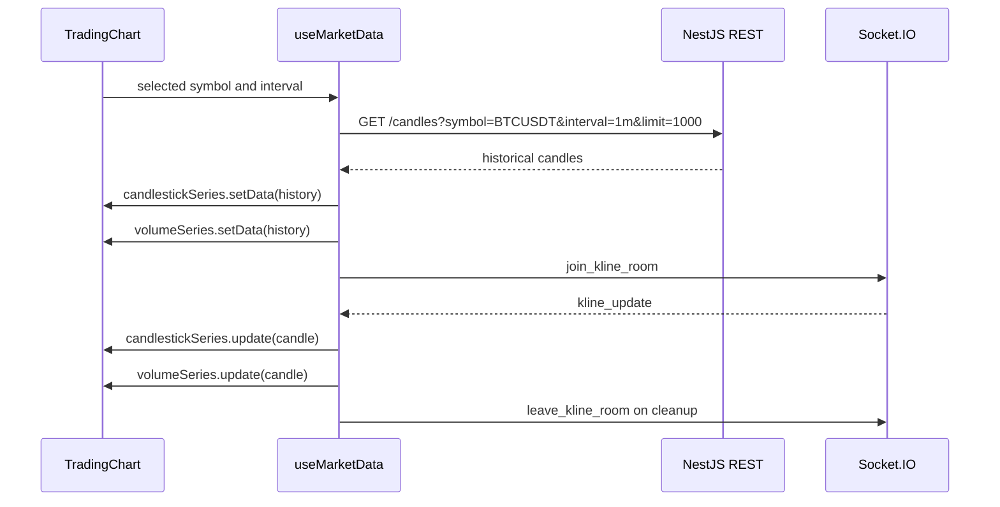

# NexTick Frontend

`frontend/` is the React charting UI for NexTick.

It loads historical candles from the NestJS REST API, joins Socket.IO rooms for realtime kline updates, and renders candlestick, volume, and indicator series with Lightweight Charts.

The frontend does not connect directly to Binance, Kafka, QuestDB, or AI/model services.

## Stack

| Area | Current dependency |
| --- | --- |
| UI | React 19 |
| Build tool | Vite |
| Language | TypeScript |
| Charting | Lightweight Charts |
| REST client | Axios |
| Realtime client | Socket.IO Client |
| Styling | Tailwind CSS with PostCSS |

## Source Structure

```text
frontend/src/
|-- App.tsx
|-- main.tsx
|-- components/
|   |-- chart/
|   |   |-- TradingChart.tsx
|   |   |-- ChartFilterBar.tsx
|   |   |-- IndicatorLegend.tsx
|   |   |-- OhlcvTooltip.tsx
|   |   |-- ScrollToLatestButton.tsx
|   |   |-- chartConstants.ts
|   |   `-- useTradingChartSetup.ts
|   |-- layout/
|   |   |-- Footer.tsx
|   |   |-- Header.tsx
|   |   `-- MainLayout.tsx
|   `-- legal/
|       `-- LegalPageLayout.tsx
|-- hooks/
|   `-- useMarketData.ts
|-- pages/
|   |-- PrivacyPage.tsx
|   `-- TermsPage.tsx
|-- services/
|   |-- api.ts
|   `-- socket.ts
|-- types/
|   `-- chart.ts
`-- utils/
    |-- formatters.ts
    |-- indicators.ts
    `-- logger.ts
```

## Local Setup

Start the backend first. The UI can render without it, but historical candles, API health status, and realtime updates require the NestJS API.

```bash
cd frontend
cp .env.example .env
npm install
npm run dev
```

On Windows PowerShell:

```powershell
cd frontend
Copy-Item .env.example .env
npm install
npm run dev
```

Build and lint:

```bash
npm run build
npm run lint
```

Preview a production build:

```bash
npm run preview
```

Default dev URL:

```text
http://localhost:5173
```

## Environment Variables

These names match `frontend/.env.example` and current frontend code.

| Variable | Required | Example | Used by |
| --- | --- | --- | --- |
| `VITE_API_URL` | Yes | `http://localhost:3000` | `src/services/api.ts`, for `GET /candles`. |
| `VITE_API_HEALTH_URL` | Yes | `http://localhost:3000/health` | Footer API status check. |
| `VITE_SOCKET_URL` | Yes | `http://localhost:3000` | Socket.IO client URL. |
| `VITE_TRADING_SYMBOLS` | Yes | `BTCUSDT,ETHUSDT` | `chartConstants.ts`, split into chart symbol options. |
| `VITE_CANDLE_INTERVALS` | Yes | `1m,3m,5m,15m,30m,1h` | `chartConstants.ts`, split into chart interval options. |

Example:

```env
VITE_API_URL=http://localhost:3000
VITE_API_HEALTH_URL=http://localhost:3000/health
VITE_SOCKET_URL=http://localhost:3000
VITE_TRADING_SYMBOLS=BTCUSDT,ETHUSDT
VITE_CANDLE_INTERVALS=1m,3m,5m,15m,30m,1h,2h,4h,6h,8h,12h,1d,3d,1w,1M
```

`VITE_TRADING_SYMBOLS` and `VITE_CANDLE_INTERVALS` are read with `.split(',')`, so do not leave them empty.

## Data Flow



## REST Contract

`getHistoricalCandles()` calls:

```text
GET {VITE_API_URL}/candles
```

Query parameters:

| Parameter | Current value |
| --- | --- |
| `symbol` | Selected chart symbol. |
| `interval` | Selected chart interval. |
| `limit` | `1000`. |

Expected response:

```json
{
  "success": true,
  "symbol": "BTCUSDT",
  "interval": "1m",
  "count": 1,
  "data": [
    {
      "timestamp": "2026-05-20T08:00:00.000Z",
      "symbol": "BTCUSDT",
      "interval": "1m",
      "open": 105000.5,
      "high": 105250.75,
      "low": 104900.25,
      "close": 105120.1,
      "volume": 12.34567
    }
  ]
}
```

## Socket.IO Contract

`src/services/socket.ts` creates a Socket.IO client using `VITE_SOCKET_URL`.

| Event | Direction | Payload | Usage |
| --- | --- | --- | --- |
| `join_kline_room` | Client to server | `{ "symbol": "BTCUSDT", "interval": "1m" }` | Sent after historical data loads successfully. |
| `leave_kline_room` | Client to server | `{ "symbol": "BTCUSDT", "interval": "1m" }` | Sent on cleanup or selected market change. |
| `kline_update` | Server to client | Candle fields plus `is_final` | Applied to the chart with `update()`. |

Realtime payload:

```json
{
  "timestamp": "2026-05-20T08:00:00+00:00",
  "symbol": "BTCUSDT",
  "interval": "1m",
  "open": 105000.5,
  "high": 105250.75,
  "low": 104900.25,
  "close": 105120.1,
  "volume": 12.34567,
  "is_final": false
}
```

## Chart Update Strategy

The frontend uses Lightweight Charts imperatively from React lifecycle hooks.

| Scenario | Lightweight Charts API | Code location |
| --- | --- | --- |
| Historical load | `candlestickSeries.setData()` and `volumeSeries.setData()` | `useMarketData.ts` |
| Symbol or interval change | Clear series, load history, then `setData()` | `useMarketData.ts` |
| Realtime candle | `candlestickSeries.update()` and `volumeSeries.update()` | `useMarketData.ts` |

Realtime updates should not call `setData()` for every tick.

`useMarketData.ts` also keeps `candleHistoryRef` so the latest realtime candle can replace the current candle or append a new one. EMA and MA indicator series are updated from the same formatted candle stream.

## Routes and UI Features

| Route or feature | Current behavior |
| --- | --- |
| `/` | Renders the realtime chart UI. |
| `/terms` | Renders static legal/demo terms content. |
| `/privacy` | Renders static legal/demo privacy content. |
| Footer API status | Calls `VITE_API_HEALTH_URL` every 30 seconds with a 5 second timeout. |
| Status labels | `Checking...`, `Online`, or `Offline`. |

The Terms and Privacy pages are static pages for the demo/portfolio UI.

## Frontend Boundary

The frontend only uses:

| Allowed dependency | Purpose |
| --- | --- |
| NestJS REST API | Historical candle loading. |
| NestJS Socket.IO | Realtime kline updates. |
| Vite env variables | Runtime URLs and selector values. |

The frontend must not:

| Direct dependency | Reason |
| --- | --- |
| Connect to Binance | Binance ingestion belongs to the Python producer. |
| Connect to Kafka | Kafka is a service-to-service boundary. |
| Query QuestDB directly | Historical reads go through backend validation and DTOs. |
| Call AI/model services directly | Future AI features need explicit backend/API contracts first. |
