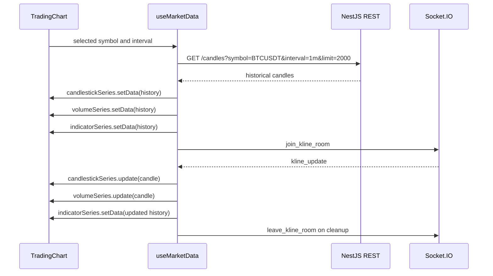

# NexTick Frontend

`frontend/` is the React charting UI for NexTick.

It loads historical candles from the NestJS REST API, joins Socket.IO rooms for realtime kline updates, and renders candlestick, volume, OHLCV tooltip, and configurable indicator series with Lightweight Charts.

The frontend does not connect directly to Binance, Kafka, QuestDB, or AI/model services.

## Stack

| Area | Current dependency |
| --- | --- |
| UI | React 19 |
| Build tool | Vite 8 |
| Language | TypeScript 6 |
| Charting | Lightweight Charts 5 |
| REST client | Axios |
| Realtime client | Socket.IO Client |
| Styling | Tailwind CSS 4 with PostCSS |

## Source Structure

```text
frontend/src/
|-- App.tsx
|-- main.tsx
|-- components/
|   |-- chart/
|   |   |-- ChartFilterBar.tsx
|   |   |-- OhlcvTooltip.tsx
|   |   |-- ScrollToLatestButton.tsx
|   |   |-- TradingChart.tsx
|   |   |-- VisibleExtremaOverlay.tsx
|   |   |-- chartConstants.ts
|   |   |-- useTradingChartSetup.ts
|   |   `-- useTradingChartState.ts
|   |-- indicators/
|   |   |-- IndicatorEyeIcon.tsx
|   |   |-- IndicatorLegend.tsx
|   |   `-- indicatorSettingsModel.ts
|   |-- layout/
|   |   |-- Footer.tsx
|   |   |-- Header.tsx
|   |   |-- MainLayout.tsx
|   |   `-- useApiHealthStatus.ts
|   `-- legal/
|       `-- LegalPageLayout.tsx
|-- hooks/
|   `-- useMarketData.ts
|-- pages/
|   |-- PrivacyPage.tsx
|   `-- TermsPage.tsx
|-- services/
|   |-- api.ts
|   `-- socket.ts
|-- types/
|   `-- chart.ts
`-- utils/
    |-- chartIndicators.ts
    |-- formatters.ts
    |-- indicators.ts
    `-- logger.ts
```

## Local Setup

Start the backend first. The UI shell can render without it, but historical candles, API health status, and realtime updates require the NestJS API.

```bash
cd frontend
cp .env.example .env
npm install
npm run dev
```

Windows PowerShell:

```powershell
cd frontend
Copy-Item .env.example .env
npm install
npm run dev
```

Build, lint, and preview:

```bash
npm run build
npm run lint
npm run preview
```

Default dev URL:

```text
http://localhost:5173
```

## Environment Variables

These names match `frontend/.env.example` and current frontend code. The example file intentionally contains blank values; local `.env` must be filled before Vite starts.

| Variable | Required | Example | Used by |
| --- | --- | --- | --- |
| `VITE_API_URL` | Yes | `http://localhost:3000` | `src/services/api.ts`, for `GET /candles`. |
| `VITE_API_HEALTH_URL` | Yes | `http://localhost:3000/health` | Footer API status check. |
| `VITE_SOCKET_URL` | Yes | `http://localhost:3000` | Socket.IO client URL. |
| `VITE_TRADING_SYMBOLS` | Recommended | `BTCUSDT,ETHUSDT` | `chartConstants.ts`, parsed into chart symbol options. Falls back to `BTCUSDT` when unset or blank. |
| `VITE_CANDLE_INTERVALS` | Recommended | `1m,3m,5m,15m,30m,1h` | `chartConstants.ts`, parsed into chart interval options. Falls back to `1m` when unset or blank. |

Example:

```env
VITE_API_URL=http://localhost:3000
VITE_API_HEALTH_URL=http://localhost:3000/health
VITE_SOCKET_URL=http://localhost:3000
VITE_TRADING_SYMBOLS=BTCUSDT,ETHUSDT
VITE_CANDLE_INTERVALS=1m,3m,5m,15m,30m,1h,2h,4h,6h,8h,12h,1d,3d,1w,1M
```

Keep `VITE_API_URL`, `VITE_API_HEALTH_URL`, and `VITE_SOCKET_URL` filled for the full app experience. The chart can fall back to `BTCUSDT` and `1m` if symbol or interval lists are missing, but explicit values are preferred so frontend options match the pipeline/backend configuration.

## Data Flow



## REST Contract

`getHistoricalCandles()` calls:

```text
GET {VITE_API_URL}/candles
```

Query parameters:

| Parameter | Current value |
| --- | --- |
| `symbol` | Selected chart symbol. |
| `interval` | Selected chart interval. |
| `limit` | `2000`. |

Expected response:

```json
{
  "success": true,
  "symbol": "BTCUSDT",
  "interval": "1m",
  "count": 1,
  "data": [
    {
      "timestamp": "2026-05-20T08:00:00.000Z",
      "symbol": "BTCUSDT",
      "interval": "1m",
      "open": 105000.5,
      "high": 105250.75,
      "low": 104900.25,
      "close": 105120.1,
      "volume": 12.34567
    }
  ]
}
```

## Socket.IO Contract

`src/services/socket.ts` creates a Socket.IO client using `VITE_SOCKET_URL`.

| Event | Direction | Payload | Usage |
| --- | --- | --- | --- |
| `join_kline_room` | Client to server | `{ "symbol": "BTCUSDT", "interval": "1m" }` | Sent after historical data loads successfully. |
| `leave_kline_room` | Client to server | `{ "symbol": "BTCUSDT", "interval": "1m" }` | Sent on cleanup or selected market change. |
| `kline_update` | Server to client | Candle fields plus `is_final` | Applied to the chart with `update()`. |

Realtime payload:

```json
{
  "timestamp": "2026-05-20T08:00:00+00:00",
  "symbol": "BTCUSDT",
  "interval": "1m",
  "open": 105000.5,
  "high": 105250.75,
  "low": 104900.25,
  "close": 105120.1,
  "volume": 12.34567,
  "is_final": false
}
```

## Chart Update Strategy

The frontend uses Lightweight Charts imperatively from React lifecycle hooks.

| Scenario | Lightweight Charts API | Code location |
| --- | --- | --- |
| Historical load | `candlestickSeries.setData()`, `volumeSeries.setData()`, and indicator `setData()` | `useMarketData.ts` |
| Symbol or interval change | Clear series, load history, then `setData()` | `useMarketData.ts` |
| Realtime candle | `candlestickSeries.update()` and `volumeSeries.update()` | `useMarketData.ts` |
| Realtime indicators | Recalculate visible indicator history and call indicator `setData()` | `useMarketData.ts` |
| Cursor tooltip | Crosshair data updates `OhlcvTooltip` and hovered indicator values | `useTradingChartSetup.ts` |
| Visible high/low labels | Visible logical range is scanned and labels are overlaid | `useTradingChartSetup.ts`, `VisibleExtremaOverlay.tsx` |

Realtime candle and volume updates should not call `setData()` for every tick. Indicator series are recalculated from the maintained candle history because EMA, MA, volume-MA, RSI, and MACD depend on historical context.

## Indicators

Default indicator settings live in `components/chart/chartConstants.ts`. Indicator UI and settings model live in `components/indicators/`; calculation helpers live in `utils/indicators.ts` and `utils/chartIndicators.ts`.

| Indicator group | Default state | Notes |
| --- | --- | --- |
| EMA | Visible | Default periods `7`, `25`, `99` on the main chart. |
| MA | Configured but hidden by group state | Default periods `7`, `25`, `99` on the main chart. |
| Volume MA | Visible | Default period `20` on the volume pane. |
| RSI | Hidden | Uses a secondary pane when enabled. |
| MACD | Hidden | Uses MACD and signal line series in a secondary pane. |

The indicator settings window supports:

| Control | Applies to |
| --- | --- |
| Visibility | All indicator groups. |
| Period slots up to `10` | EMA, MA, volume-MA. |
| Price source | EMA, MA, RSI, MACD. |
| Line width and color | All visible line indicators. |
| Fast, slow, and signal periods | MACD. |

## Routes and UI Features

| Route or feature | Current behavior |
| --- | --- |
| `/` | Renders the realtime chart UI. |
| `/terms` | Renders static legal/demo terms content. |
| `/privacy` | Renders static legal/demo privacy content. |
| Symbol and interval controls | Read options from Vite env. |
| Footer API status | Calls `VITE_API_HEALTH_URL` every 30 seconds with a 5 second timeout. |
| Status labels | `Checking...`, `Online`, or `Offline`. |

Routing is currently implemented by checking `window.location.pathname` in `App.tsx`; there is no React Router dependency.

## Frontend Boundary

The frontend only uses:

| Allowed dependency | Purpose |
| --- | --- |
| NestJS REST API | Historical candle loading. |
| NestJS Socket.IO | Realtime kline updates. |
| Vite env variables | Runtime URLs and selector values. |

The frontend must not:

| Direct dependency | Reason |
| --- | --- |
| Connect to Binance | Binance ingestion belongs to the Python producer. |
| Connect to Kafka | Kafka is a service-to-service boundary. |
| Query QuestDB directly | Historical reads go through backend validation and DTOs. |
| Call AI/model services directly | Future AI features need explicit backend/API contracts first. |
