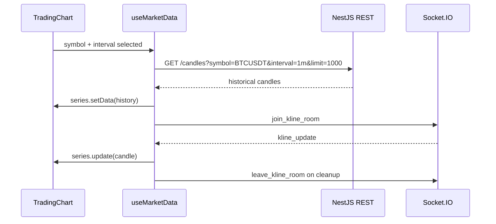

# NexTick Frontend

React charting interface for realtime cryptocurrency candles.

The frontend is a high-performance UI client. It loads historical candles through the NestJS REST API, joins Socket.IO rooms for realtime updates, and renders price and volume with Lightweight Charts. It does not connect directly to Binance, Kafka, QuestDB, or AI/model services.

## Responsibilities

| Capability | Implementation |
| --- | --- |
| Historical data loading | `src/services/api.ts` calls `GET /candles`. |
| Realtime transport | `src/services/socket.ts` manages Socket.IO connection and room events. |
| Data orchestration | `src/hooks/useMarketData.ts` loads history, joins/leaves rooms, and updates series. |
| Chart rendering | `src/components/chart/TradingChart.tsx` owns Lightweight Charts lifecycle and UI controls. |
| Formatting and validation | `src/utils/formatters.ts` normalizes API/socket candles before chart rendering. |

## Setup

Install dependencies:

```bash
cd frontend
npm install
```

Create the environment file:

```bash
cp .env.example .env
```

Start the Vite dev server:

```bash
npm run dev
```

Useful commands:

```bash
npm run build
npm run lint
npm run preview
```

Default local URL:

```text
http://localhost:5173
```

## Environment Variables

| Variable | Required | Example | Description |
| --- | --- | --- | --- |
| `VITE_API_URL` | Yes | `http://localhost:3000` | Base URL for the NestJS REST API. Used by `src/services/api.ts`. |
| `VITE_SOCKET_URL` | Yes | `http://localhost:3000` | Socket.IO server URL. Used by `src/services/socket.ts`. |
| `VITE_TRADING_SYMBOLS` | Yes | `BTCUSDT,ETHUSDT` | Comma-separated symbol list displayed by the chart symbol selector. |
| `VITE_CANDLE_INTERVALS` | Yes | `1m,5m,15m,1h` | Comma-separated interval list displayed by the chart interval controls. |

Example:

```env
VITE_API_URL=http://localhost:3000
VITE_SOCKET_URL=http://localhost:3000
VITE_TRADING_SYMBOLS=BTCUSDT,ETHUSDT
VITE_CANDLE_INTERVALS=1m,5m,15m,1h
```

## Data Flow



## Charting Philosophy

NexTick uses Lightweight Charts as an imperative rendering engine managed by React lifecycle boundaries.

The core rule is simple: React owns controls and lifecycle; Lightweight Charts owns high-frequency drawing.

### React 19 Memory Management

Chart and series instances are stored in refs, not state:

```ts
const chartInstanceRef = useRef<IChartApi | null>(null);
const candlestickSeriesRef = useRef<ISeriesApi<"Candlestick"> | null>(null);
const volumeSeriesRef = useRef<ISeriesApi<"Histogram"> | null>(null);
```

The chart effect must clean up all owned resources:

```ts
return () => {
  chart.unsubscribeCrosshairMove(handleCrosshair);
  resizeObserver.disconnect();
  chartInstanceRef.current = null;
  candlestickSeriesRef.current = null;
  volumeSeriesRef.current = null;
  chart.remove();
};
```

This prevents chart instances, resize observers, crosshair listeners, and series references from surviving React remounts.

## Realtime Update Logic

Historical data and realtime data use different chart APIs.

| Scenario | API | Reason |
| --- | --- | --- |
| Initial history load | `series.setData()` | Replaces the full series after a symbol/interval change. |
| Full symbol/interval replacement | `series.setData()` | Clears stale data and loads the new history. |
| Realtime candle update | `series.update()` | Updates or appends one candle in O(1) chart work. |

Realtime updates must not call `setData()` for every tick. The current hook follows the intended pattern:

```ts
candlestickSeries.update({
  time: formatted.time as Time,
  open: formatted.open,
  high: formatted.high,
  low: formatted.low,
  close: formatted.close,
});

volumeSeries.update({
  time: formatted.time as Time,
  value: formatted.volume,
  color: formatted.close >= formatted.open ? '#26a69a80' : '#ef535080',
});
```

This keeps the UI responsive while non-final candles stream at a high cadence.

## REST Contract

`getHistoricalCandles()` calls:

```text
GET {VITE_API_URL}/candles
```

Query parameters:

| Parameter | Example | Description |
| --- | --- | --- |
| `symbol` | `BTCUSDT` | Trading pair. |
| `interval` | `1m` | Candle interval. |
| `limit` | `1000` | Maximum candles requested for initial chart history. |

Response data is expected under the `data` property:

```json
{
  "success": true,
  "symbol": "BTCUSDT",
  "interval": "1m",
  "count": 1000,
  "data": []
}
```

## Socket.IO Contract

The socket service connects to `VITE_SOCKET_URL` with websocket and polling transports enabled.

| Event | Direction | Payload | Usage |
| --- | --- | --- | --- |
| `join_kline_room` | Client to server | `{ "symbol": "BTCUSDT", "interval": "1m" }` | Sent after historical data loads successfully. |
| `leave_kline_room` | Client to server | `{ "symbol": "BTCUSDT", "interval": "1m" }` | Sent when the hook cleans up or the selected market changes. |
| `kline_update` | Server to client | Candle plus `is_final` | Consumed by `subscribeToCandles()` and applied with `series.update()`. |

Realtime candle payload:

```json
{
  "timestamp": "2026-05-20T08:00:00.000Z",
  "symbol": "BTCUSDT",
  "interval": "1m",
  "open": 105000.5,
  "high": 105250.75,
  "low": 104900.25,
  "close": 105120.1,
  "volume": 12.34567,
  "is_final": false
}
```

## Frontend Boundary

The frontend must only use:

| Allowed | Purpose |
| --- | --- |
| NestJS REST API | Historical reads and validated request/response contracts. |
| NestJS Socket.IO | Realtime candle updates by room. |
| Vite environment variables | Runtime URLs and supported chart selectors. |

The frontend must not connect directly to:

| Forbidden Direct Dependency | Reason |
| --- | --- |
| Binance WebSocket | Ingestion belongs to the Python producer. |
| Kafka | Kafka is a service-to-service boundary, not a browser contract. |
| QuestDB | Historical reads must go through backend validation and DTOs. |
| AI/model services | Forecasting must be integrated through explicit backend/API contracts. |
