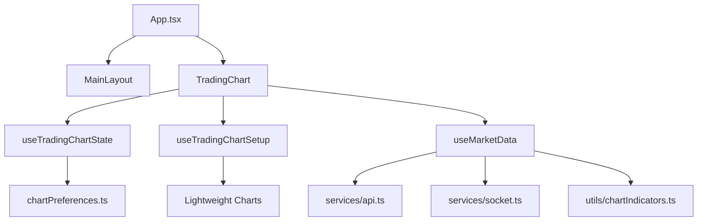
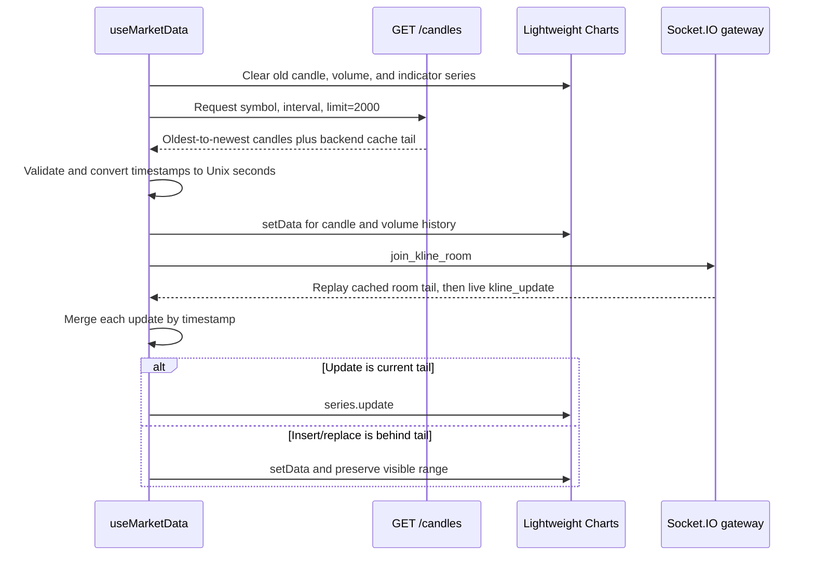

# NexTick Frontend

The frontend is NexTick's browser client. It loads candle history from the NestJS REST API, receives realtime kline updates through Socket.IO, merges both paths into one ordered in-memory history, and renders an interactive multi-pane chart.

It does not connect directly to Binance, Kafka, or QuestDB. Backend contracts are described in the [backend guide](../backend/README.md); cross-system guarantees and trade-offs are in [System Architecture](../docs/architecture.md).

## Technology Stack

| Area | Technology |
| --- | --- |
| UI | React 19, TypeScript 6 |
| Development/build | Vite 8 |
| Styling | Tailwind CSS 4, PostCSS, application CSS |
| Charting | Lightweight Charts 5 |
| Historical transport | Axios |
| Realtime transport | Socket.IO Client 4 |
| Static analysis | ESLint 10 |

## Frontend Architecture



| Path | Responsibility |
| --- | --- |
| `src/App.tsx` | Selects chart, `/terms`, or `/privacy` from `window.location.pathname` |
| `src/components/chart/TradingChart.tsx` | Composes controls, chart, overlays, tooltip, and indicator legend |
| `src/components/chart/useTradingChartState.ts` | Owns selected market, refs, indicator settings, UI state, and preference writes |
| `src/components/chart/useTradingChartSetup.ts` | Creates chart/series, panes, crosshair behavior, resizing, and visible extrema |
| `src/hooks/useMarketData.ts` | Coordinates REST history, room lifecycle, realtime merge, gap repair, and indicator synchronization |
| `src/services/api.ts` | Calls `GET {VITE_API_URL}/candles` |
| `src/services/socket.ts` | Creates the Socket.IO client and reference-counts room subscriptions |
| `src/components/indicators/` | Indicator legend and settings UI |
| `src/utils/indicators.ts` | EMA, MA, volume MA, RSI, and MACD calculations |
| `src/utils/formatters.ts` | Candle validation/conversion and localized labels |
| `src/components/layout/useApiHealthStatus.ts` | Polls the backend health endpoint |

## Historical and Realtime Data Flow



The Socket.IO listener is registered while the REST request is in flight, but the room is joined only after valid history loads. The backend's cache merge and room-tail replay reduce the normal gap between the REST response and room join.

### Initial load and market changes

When the chart is ready or `symbol`/`interval` changes, `useMarketData`:

1. clears all plotted data and in-memory candle/volume refs;
2. requests up to 2000 candles;
3. drops records with invalid timestamps or non-finite/non-positive OHLC values;
4. initializes candle and volume series with `setData()`;
5. recalculates every configured indicator from the history;
6. sets an initial range of roughly 30 visible candles plus right offset; and
7. joins the matching Socket.IO room.

Cleanup unsubscribes the `kline_update` callback and leaves the previous room. Room helpers reference-count subscriptions so multiple consumers in one page do not send duplicate joins or premature leaves.

### Realtime merge and out-of-order handling

Formatted history is kept in timestamp order. A binary search finds the insertion point for each update:

- the same timestamp replaces the existing candle;
- a new latest timestamp uses Lightweight Charts `update()` for candle and volume series;
- an insertion or replacement behind the latest timestamp resends the full series with `setData()` and restores the previous logical visible range; and
- all visible indicator series are recalculated from the merged history.

The frontend does not retain `is_final` in `FormattedCandle`. Same-timestamp replacement is unconditional, so it does not enforce final-over-non-final precedence if transport events arrive out of order.

### Recent gap repair

After a realtime update, the hook checks the last 12 candles for a gap larger than the selected interval. A detected gap schedules REST refetch/merge attempts after 1, 2.5, 5, and 10 seconds. The merge deduplicates by timestamp and resynchronizes the full chart.

This is bounded convergence logic, not complete reconciliation: it does not scan older history, retry a failed initial load, or continue indefinitely.

## REST and Socket.IO Usage

Historical request:

```text
GET {VITE_API_URL}/candles?symbol=BTCUSDT&interval=1m&limit=2000
```

Socket events:

| Event | Direction | Frontend behavior |
| --- | --- | --- |
| `join_kline_room` | Client to server | Sent after valid history loads with `{ symbol, interval }` |
| `leave_kline_room` | Client to server | Sent during hook cleanup when the local reference count reaches zero |
| `kline_update` | Server to client | Filtered by current symbol/interval, validated, formatted, and merged |

The Socket.IO client enables WebSocket and polling, credentials, automatic connection, and five reconnect attempts with delays from one through five seconds. It does not currently re-emit active room joins on a new `connect` event; after a successful transport reconnect, reload or change the market selection to rejoin.

## Chart Rendering

The main view includes:

- candlesticks and a dedicated volume pane;
- responsive resizing and resizable pane separators;
- localized time/number formatting using the `vi-VN` locale;
- crosshair-linked OHLCV and indicator values;
- visible-range high and low labels;
- a scroll-to-latest control;
- symbol and interval selectors from environment configuration; and
- a footer that checks backend health every 30 seconds with a five-second timeout.

Lightweight Charts receives Unix-second timestamps. Invalid candle records are logged and omitted rather than passed into the chart library.

## Indicators

Indicator calculations run in the browser over the full in-memory candle history.

| Group | Default | Pane | Calculation |
| --- | --- | --- | --- |
| EMA | 7, 25, and 99 visible | Main price pane | Exponential moving average from selected OHLC source |
| MA | 7, 25, and 99 configured; group hidden | Main price pane | Rolling arithmetic mean from selected OHLC source |
| Volume MA | 20 visible | Volume pane | Rolling mean of volume |
| RSI | 14 disabled | Secondary pane when enabled | Wilder-style smoothed gain/loss calculation |
| MACD | 12/26/9 disabled | Secondary pane when enabled | Fast EMA minus slow EMA plus EMA signal line |

The settings window supports visibility, period values, price source where applicable, line width, and colors. RSI and MACD panes are created only when enabled. Indicator recalculation uses `setData()` because changing an earlier candle can affect all later values.

These indicators are visual calculations, not trading signals or advice.

## Preferences and State Persistence

The browser saves these chart preferences in `sessionStorage` under `nextick:trading-chart:preferences:v1`:

- indicator settings;
- hidden indicator groups;
- time-axis bar spacing; and
- main/volume pane stretch factors.

Loaded data is validated and clamped before use. Invalid JSON removes the stored entry. Storage failures are ignored because preferences are non-critical. `Ctrl+F5` invokes the application reset path and restores current defaults.

`sessionStorage` is scoped to the browser tab/session; it is not durable user-profile storage. Selected symbol and interval are not persisted.

## Frontend Design Decisions

- **REST snapshot before room join.** A complete ordered base is simpler to render and reason about than reconstructing history from Socket.IO. The trade-off is that an initial REST failure also prevents the room join.
- **Timestamp-keyed client merge.** It makes REST/cache/socket overlap idempotent for chart identity. The current model omits finality, so it cannot reject a late non-final update.
- **Incremental tail updates, full out-of-order resync.** `update()` keeps the common path small; `setData()` handles delayed inserts safely while retaining viewport position. Frequent out-of-order events would make this more expensive.
- **Client-side indicators.** Settings take effect immediately without backend contracts or persisted derived series. Every update recalculates indicator history in the browser.
- **Session-scoped preferences.** Chart layout survives reloads in one tab without accounts or server storage, but does not follow a user between sessions/devices.

The choice of Lightweight Charts and the REST/Socket.IO split is discussed in [Architecture Decisions and Trade-offs](../docs/architecture.md#architecture-decisions-and-trade-offs).

## Environment Variables

Create `.env` from `.env.example`. Exact local values are in the [setup guide](../docs/setup.md#frontendenv).

| Variable | Use |
| --- | --- |
| `VITE_API_URL` | Backend base URL used for `GET /candles`; required by the API service |
| `VITE_API_HEALTH_URL` | Full `/health` URL used by the footer |
| `VITE_SOCKET_URL` | Socket.IO server URL |
| `VITE_TRADING_SYMBOLS` | Comma-separated selector options; defaults to `BTCUSDT` if empty |
| `VITE_CANDLE_INTERVALS` | Comma-separated selector options; defaults to `1m` if empty |

These values are embedded by Vite. Restart the dev server or rebuild after changes.

## Development Commands

```bash
npm ci
npm run dev
npm run lint
npm run build
npm run preview
```

| Command | Behavior |
| --- | --- |
| `npm run dev` | Start Vite's development server |
| `npm run lint` | Run ESLint without automatic fixes |
| `npm run build` | Run TypeScript project builds, then create the Vite production bundle |
| `npm run preview` | Serve the built bundle for local inspection |

## Testing Status

The frontend has no `test` script and no committed automated test files. `npm run lint` and `npm run build` provide static checks only; they do not verify market-data merging, Socket.IO lifecycle, chart interaction, indicators, preference migration, or browser rendering.

High-value future coverage would include unit tests for merge/finality and indicators, hook tests for REST/socket races and reconnects, and browser tests for market switching and preference restoration.

## Current Frontend Limitations

- No automated test runner or browser test suite.
- Active Socket.IO rooms are not rejoined after transport reconnection.
- Initial REST failure leaves the chart empty and prevents room join; there is no initial-load retry loop.
- Same-timestamp updates do not retain or compare `is_final`.
- Recent gap repair checks only the last 12 candles and makes four attempts.
- Indicator series are recalculated over the full in-memory history on every accepted update.
- Symbols and intervals are build-time configuration rather than discovered from the backend.
- `/terms` and `/privacy` use direct pathname selection rather than a routing library.
- The repository has no committed UI screenshot or automated visual regression baseline.
