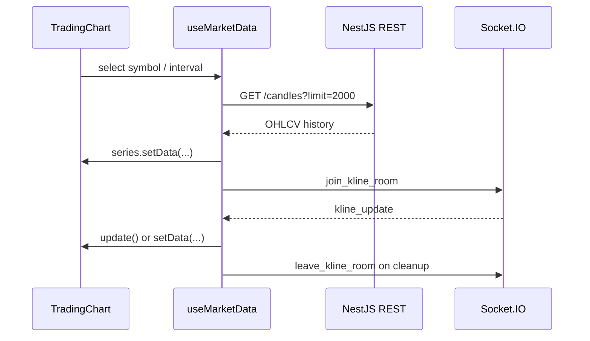

# NexTick Frontend

`frontend/` is NexTick's React/Vite charting UI. It loads historical data from the NestJS REST API, receives real-time candles through Socket.IO, and renders them with Lightweight Charts.

The frontend does not connect directly to Binance, Kafka, or QuestDB.

## Run locally

The backend must be running for history, real-time updates, and API health status. From `frontend/`:

```powershell
Copy-Item .env.example .env
npm install
npm run dev
```

Open `http://localhost:5173`.

Example `.env`:

```env
VITE_API_URL=http://localhost:3000
VITE_API_HEALTH_URL=http://localhost:3000/health
VITE_SOCKET_URL=http://localhost:3000
VITE_TRADING_SYMBOLS=BTCUSDT,ETHUSDT
VITE_CANDLE_INTERVALS=1m,3m,5m,15m,30m,1h,2h,4h,6h,8h,12h,1d,3d,1w,1M
```

| Variable | Purpose |
| --- | --- |
| `VITE_API_URL` | Base URL for `GET /candles`; required to load charts. |
| `VITE_API_HEALTH_URL` | `/health` URL used by the footer status check. |
| `VITE_SOCKET_URL` | Backend Socket.IO URL. |
| `VITE_TRADING_SYMBOLS` | Comma-separated symbols for the selector. Missing/blank falls back to `BTCUSDT`. |
| `VITE_CANDLE_INTERVALS` | Comma-separated intervals for the selector. Missing/blank falls back to `1m`. |

Vite embeds `VITE_*` variables at startup/build time, so restart the development server after changing `.env`. Keep the symbol and interval lists in sync with the pipeline and backend configuration.

## Data flow



1. When the chart is ready, `useMarketData` clears the old series and calls `GET {VITE_API_URL}/candles` with the selected `symbol`, `interval`, and `limit=2000`.
2. If valid history is returned, the application renders candles, volume, and indicators before joining the Socket.IO room.
3. In-order real-time candles use `series.update()`. Delayed or out-of-order candles are merged by timestamp, then the series is resynchronized with `setData()` while keeping the visible range.
4. When a gap appears near the latest data, the app refetches and merges history after 1s, 2.5s, 5s, and 10s delays.
5. Indicators are recalculated from the in-memory candle history because they depend on earlier candles.

The Socket.IO client uses `websocket` and `polling`, and retries reconnection up to five times. It reference-counts room subscriptions so multiple components do not send duplicate join/leave events.

## REST and Socket.IO contracts

REST:

```text
GET {VITE_API_URL}/candles?symbol=BTCUSDT&interval=1m&limit=2000
```

Socket events:

| Event | Direction | Payload |
| --- | --- | --- |
| `join_kline_room` | Client → server | `{ "symbol": "BTCUSDT", "interval": "1m" }` |
| `leave_kline_room` | Client → server | `{ "symbol": "BTCUSDT", "interval": "1m" }` |
| `kline_update` | Server → client | `timestamp`, `symbol`, `interval`, OHLCV, `is_final` |

Backend timestamps are converted to Unix seconds before reaching Lightweight Charts. Candles with invalid OHLC values are not rendered.

## UI features

| Area | Current behavior |
| --- | --- |
| Chart | Candlesticks, volume, OHLCV tooltip, visible-range high/low labels, and a button to return to the latest candles. |
| Filters | Symbol and interval selectors sourced from `VITE_TRADING_SYMBOLS` and `VITE_CANDLE_INTERVALS`. |
| Indicators | EMA, MA, Volume MA, RSI, and MACD; users can change visibility, price source, period, line width, and color. |
| Indicator layout | EMA/MA use the main chart, Volume MA uses the volume pane, and RSI/MACD use secondary panes when enabled. |
| Preferences | Indicator settings, hidden groups, bar spacing, and pane stretch factors are stored in `sessionStorage` under `nextick:trading-chart:preferences:v1`. `Ctrl+F5` resets current preferences to defaults. |
| Footer | Calls the health URL every 30 seconds with a 5-second timeout; shows `Checking...`, `Online`, or `Offline`. |
| Static pages | `/terms` and `/privacy`; routing currently uses `window.location.pathname`, without React Router. |

EMA 7/25/99 and Volume MA 20 are visible by default. MA 7/25/99 settings exist but their group starts hidden; RSI 14 and MACD 12/26/9 start disabled.

## Source structure

```text
src/
├── App.tsx                       # Selects chart, terms, or privacy page
├── hooks/useMarketData.ts        # REST, Socket.IO, merging, and history repair
├── services/api.ts               # GET /candles
├── services/socket.ts            # Socket client and room subscriptions
├── components/chart/             # Chart, setup/state, controls, tooltip, overlays
├── components/indicators/        # Legend and indicator settings window
├── components/layout/            # Header, footer, API health check
└── utils/                        # Formatters, indicator calculations, logger
```

## npm commands

```bash
npm run dev      # Vite development server
npm run build    # type-check and production build
npm run lint     # ESLint
npm run preview  # preview the production build
```

See the [backend README](../backend/README.md) for the complete API and Socket.IO contract, and the [root README](../README.md) to start the entire system.
